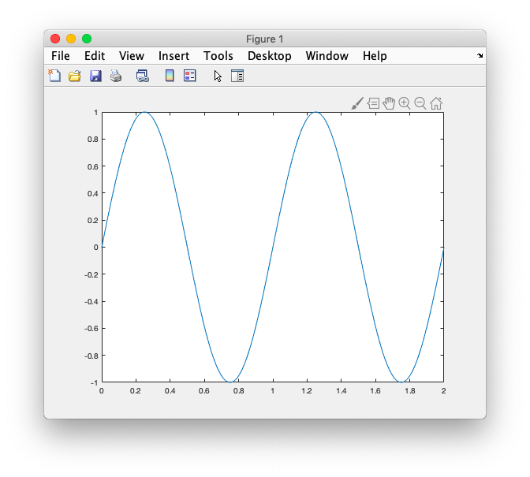
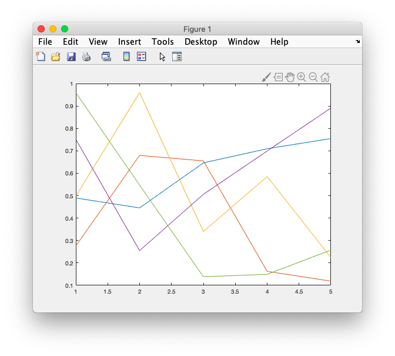
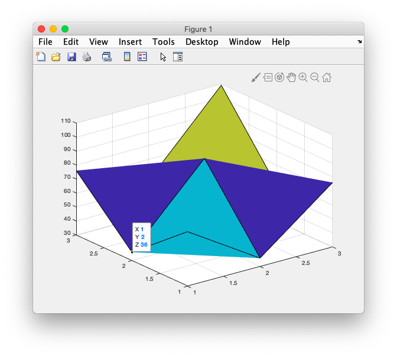
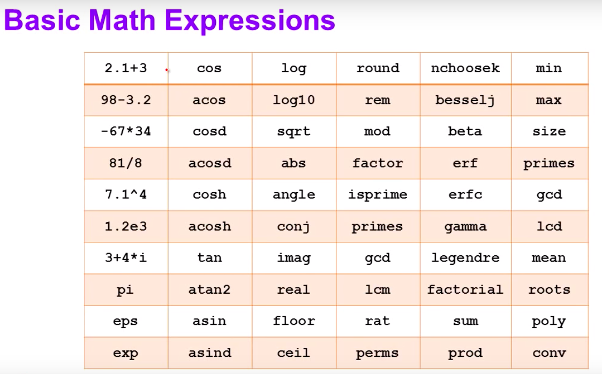

# 1. Basic


### # code

```matlab

	Trial License -- for use to evaluate programs for possible purchase as an end-user only.

>> a =3

a =
     3

>> b = 2

b =
     2

>> a+b

ans =
     5

>> a+b

ans =
     5

>> a = 45

a =
    45

>> cos(a)

ans =

    0.5253

>> cosd(a)

ans =
    0.7071

>> 1/sqrt(2)

ans =

    0.7071

>>  doc cos
>> help cos
 cos    Cosine of argument in radians.
    cos(X) is the cosine of the elements of X. 
 
    See also acos, cosd, cospi.

    Reference page for cos
    Other functions named cos

>> 
>> 
>> a = [ 1 3 2 5]

a =
     1     3     2     5

>> t = 1:8

t =
  Columns 1 through 7
     1     2     3     4     5     6     7

  Column 8

     8

>> whos
  Name      Size            Bytes  Class     Attributes

  a         1x4                32  double              
  ans       1x1                 8  double              
  b         1x1                 8  double              
  t         1x8                64  double              

>> y = sin(2*pi*t):
 y = sin(2*pi*t):
                 ↑
Error: Invalid expression. Check for missing
or extra characters.
 
>> y = sin(2 * pi * t):
 y = sin(2 * pi * t):
                     ↑
Error: Invalid expression. Check for missing
or extra characters.
 
>> y = sin(2 * pi * t);
>> t = 0:0.01:2

t =

  Columns 1 through 4

         0    0.0100    0.0200    0.0300

  Columns 5 through 8

    0.0400    0.0500    0.0600    0.0700

  Columns 9 through 12

    0.0800    0.0900    0.1000    0.1100

  Columns 13 through 16

    0.1200    0.1300    0.1400    0.1500

  Columns 17 through 20

    0.1600    0.1700    0.1800    0.1900

  Columns 21 through 24

    0.2000    0.2100    0.2200    0.2300

  Columns 25 through 28

    0.2400    0.2500    0.2600    0.2700

  Columns 29 through 32

    0.2800    0.2900    0.3000    0.3100

  Columns 33 through 36

    0.3200    0.3300    0.3400    0.3500

  Columns 37 through 40

    0.3600    0.3700    0.3800    0.3900

  Columns 41 through 44

    0.4000    0.4100    0.4200    0.4300

  Columns 45 through 48

    0.4400    0.4500    0.4600    0.4700

  Columns 49 through 52

    0.4800    0.4900    0.5000    0.5100

  Columns 53 through 56

    0.5200    0.5300    0.5400    0.5500

  Columns 57 through 60

    0.5600    0.5700    0.5800    0.5900

  Columns 61 through 64

    0.6000    0.6100    0.6200    0.6300

  Columns 65 through 68

    0.6400    0.6500    0.6600    0.6700

  Columns 69 through 72

    0.6800    0.6900    0.7000    0.7100

  Columns 73 through 76

    0.7200    0.7300    0.7400    0.7500

  Columns 77 through 80

    0.7600    0.7700    0.7800    0.7900

  Columns 81 through 84

    0.8000    0.8100    0.8200    0.8300

  Columns 85 through 88

    0.8400    0.8500    0.8600    0.8700

  Columns 89 through 92

    0.8800    0.8900    0.9000    0.9100

  Columns 93 through 96

    0.9200    0.9300    0.9400    0.9500

  Columns 97 through 100

    0.9600    0.9700    0.9800    0.9900

  Columns 101 through 104

    1.0000    1.0100    1.0200    1.0300

  Columns 105 through 108

    1.0400    1.0500    1.0600    1.0700

  Columns 109 through 112

    1.0800    1.0900    1.1000    1.1100

  Columns 113 through 116

    1.1200    1.1300    1.1400    1.1500

  Columns 117 through 120

    1.1600    1.1700    1.1800    1.1900

  Columns 121 through 124

    1.2000    1.2100    1.2200    1.2300

  Columns 125 through 128

    1.2400    1.2500    1.2600    1.2700

  Columns 129 through 132

    1.2800    1.2900    1.3000    1.3100

  Columns 133 through 136

    1.3200    1.3300    1.3400    1.3500

  Columns 137 through 140

    1.3600    1.3700    1.3800    1.3900

  Columns 141 through 144

    1.4000    1.4100    1.4200    1.4300

  Columns 145 through 148

    1.4400    1.4500    1.4600    1.4700

  Columns 149 through 152

    1.4800    1.4900    1.5000    1.5100

  Columns 153 through 156

    1.5200    1.5300    1.5400    1.5500

  Columns 157 through 160

    1.5600    1.5700    1.5800    1.5900

  Columns 161 through 164

    1.6000    1.6100    1.6200    1.6300

  Columns 165 through 168

    1.6400    1.6500    1.6600    1.6700

  Columns 169 through 172

    1.6800    1.6900    1.7000    1.7100

  Columns 173 through 176

    1.7200    1.7300    1.7400    1.7500

  Columns 177 through 180

    1.7600    1.7700    1.7800    1.7900

  Columns 181 through 184

    1.8000    1.8100    1.8200    1.8300

  Columns 185 through 188

    1.8400    1.8500    1.8600    1.8700

  Columns 189 through 192

    1.8800    1.8900    1.9000    1.9100

  Columns 193 through 196

    1.9200    1.9300    1.9400    1.9500

  Columns 197 through 200

    1.9600    1.9700    1.9800    1.9900

  Column 201

    2.0000

>> plot(t,y)
Error using plot
Vectors must be the same length.
 
>> y = sin(2 * pi * t);
>> plot(t,y)
>> a = 3 + 2i

a =

   3.0000 + 2.0000i

>> real(a)

ans =

     3

>> imag(a)

ans =

     2

>> abs(a)

ans =

    3.6056

>> sqrt(3^2+2^2)

ans =

    3.6056

>> noise = rand(5)

noise =

  Columns 1 through 4

    0.8147    0.0975    0.1576    0.1419
    0.9058    0.2785    0.9706    0.4218
    0.1270    0.5469    0.9572    0.9157
    0.9134    0.9575    0.4854    0.7922
    0.6324    0.9649    0.8003    0.9595

  Column 5

    0.6557
    0.0357
    0.8491
    0.9340
    0.6787

>> noise = rand(5,4)

noise =

    0.7577    0.7060    0.8235    0.4387
    0.7431    0.0318    0.6948    0.3816
    0.3922    0.2769    0.3171    0.7655
    0.6555    0.0462    0.9502    0.7952
    0.1712    0.0971    0.0344    0.1869

>> noise = rand(5,5)

noise =

  Columns 1 through 4

    0.4898    0.2760    0.4984    0.7513
    0.4456    0.6797    0.9597    0.2551
    0.6463    0.6551    0.3404    0.5060
    0.7094    0.1626    0.5853    0.6991
    0.7547    0.1190    0.2238    0.8909

  Column 5

    0.9593
    0.5472
    0.1386
    0.1493
    0.2575

>> plot(noise)
>> plot(noise)
>> inv(noise)

ans =

  Columns 1 through 4

  -23.4437   31.9222  -23.3664  -39.9099
    6.9090   -9.4707    8.7560   10.9260
    4.6542   -6.1012    4.1206   10.1176
   19.7506  -27.4505   20.0195   34.0536
   -6.8619   11.0947   -8.4087  -14.6931

  Column 5

   55.2156
  -16.6604
  -12.4570
  -45.7632
   18.9145

>> noise*inv(noise)

ans =

  Columns 1 through 4

    1.0000   -0.0000    0.0000    0.0000
   -0.0000    1.0000    0.0000    0.0000
   -0.0000    0.0000    1.0000   -0.0000
    0.0000   -0.0000    0.0000    1.0000
    0.0000   -0.0000    0.0000    0.0000

  Column 5

    0.0000
    0.0000
   -0.0000
   -0.0000
    1.0000

>> p = floor(rand(3) * 10)

p =

     8     2     1
     2     9     2
     8     3     6

>> p

p =

     8     2     1
     2     9     2
     8     3     6

>> p'

ans =

     8     2     8
     2     9     3
     1     2     6

>> w = p * p'

w =

    69    36    76
    36    89    55
    76    55   109

>> surf(w)
>> format loose
>> pi

ans =

    3.1416

>> format compact
>> pi
ans =
    3.1416
>> format rat
>> pi
ans =
     355/113   
>> format long
>> pi
ans =
   3.141592653589793
>> format short
>> pi
ans =
    3.1416
>> q = 1
q =
     1
>> w = 2;
>> 
```


### # image










