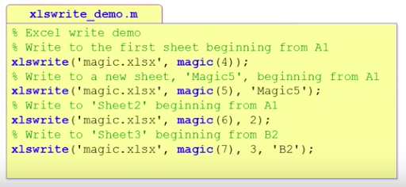

# 9. File writing, Reading


### # file writing(txt)

```matlab
n = (1:9)';
times2 = [2*ones(9,1) n 2*n];
fid=fopen('times2.txt','w');
fprintf(fid,'%d x %d = %2d\n', times2');
fclose(fid);

```


### # file reading(excel)

```matlab
% READ
a = xlsread('sample.xlsx',-1)
% -1 : option to select range
a = xlsread('sample.xlsx','sheet1','A3:B4')

```


### # file writing(excel)

