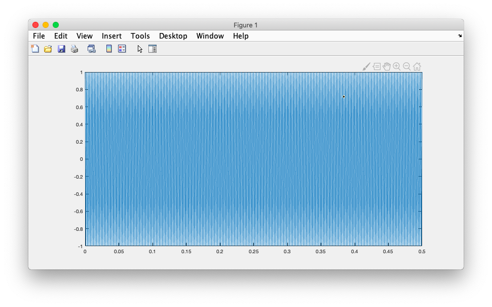

# 10.


### # magin,sum,select

```matlab
>> m =magic(3)

m =

     8     1     6
     3     5     7
     4     9     2

>> sum(m)

ans =

    15    15    15

>> sum(m,2)

ans =

    15
    15
    15

>> sum(diag(m))

ans =

    15

>> max(m)

ans =

     8     9     7

>> m

m =

     8     1     6
     3     5     7
     4     9     2

>> m23=m(:[2 3])
 m23=m(:[2 3])
        ↑
Error: Invalid expression. When calling a
function or indexing a variable, use
parentheses. Otherwise, check for mismatched
delimiters.
 
>> m23=m(:,[2 3])

m23 =

     1     6
     5     7
     9     2
```


### # plot

```matlab
>> Fs = 16e3;
>> f0=440;
>> t = 0:1/Fs:0.5;
>> s = cos(2*pi*f0*t);
>> plot(t,s)
```




### # array change

```matlab
>> M1 = magic(4)

M1 =

    16     2     3    13
     5    11    10     8
     9     7     6    12
     4    14    15     1

>> M2 = randi(10,4)

M2 =

     5     7     7     7
    10     1     8     2
     8     9     8     8
    10    10     4     1

>> M = [M1,M2]

M =

    16     2     3    13     5     7     7     7
     5    11    10     8    10     1     8     2
     9     7     6    12     8     9     8     8
     4    14    15     1    10    10     4     1


>> M3 = [M1;M2]

M3 =

    16     2     3    13
     5    11    10     8
     9     7     6    12
     4    14    15     1
     5     7     7     7
    10     1     8     2
     8     9     8     8
    10    10     4     1

>> 
```


### # string

```matlab
s =

    'yes'

>> s(1)

ans =

    'y'

>> s(end)

ans =

    's'

>> msg1 = ['yes','nop','thanks']

msg1 =

    'yesnopthanks'
    
    
>> msge = {'abc','bcd','asdd'}

msge =

  1×3 cell array

    {'abc'}    {'bcd'}    {'asdd'}

>> msge(2)

ans =

  1×1 cell array

    {'bcd'}

>> msge{2}

ans =

    'bcd'


```


