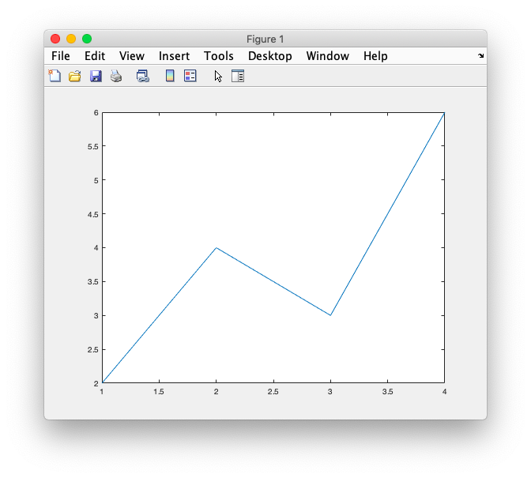
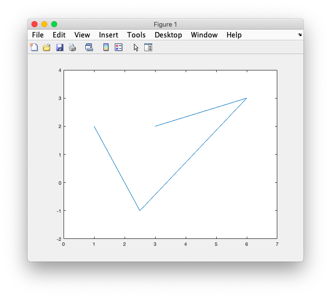
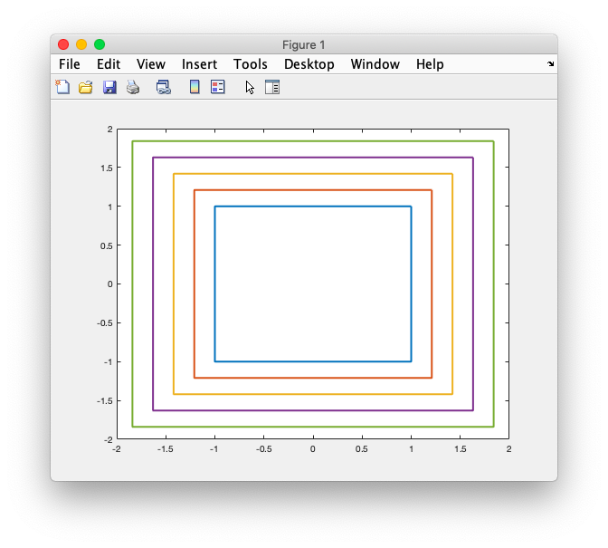
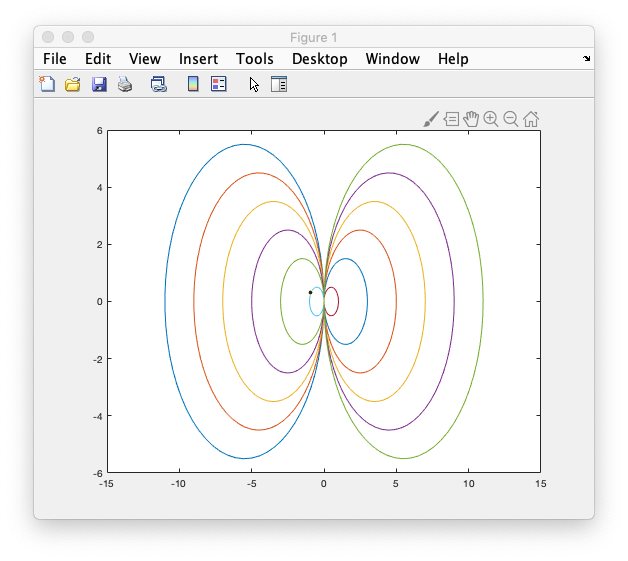

# 12. Graph


### # line

```matlab
y = [ 2 4 3 6];
figure(1);
plot(y);
```




### # X, Y Vectors

```matlab
x =[1 2.5 6 3];
y =[2 -1 3 2];
plot(x,y);
axis([0 7 -2 +4]);
```




### # matrix

```matlab
x = [1 -1 -1 1 1]'
y = [1 1 -1 -1 1]'
% x,y = 5x1
%0
%0
%0
%0
%0

s = 1:0.21:2; % s= 1xN

X = x * s;
Y = y * s;

% X, Y = 5 X N

plot(X,Y,'LineWidth',2); % N ea

% Change scaling
```




### # joining circle

```matlab
t = 0:0.1:2*pi+0.1; %theta 1 X N
N = length(t); 
x = cos(t'); % N x 1
y = sin(t');

c = -5.5:5.5; % -5.5 -4.5 ... 
C = repmat(c,N,1); %copy C x N ea
r = abs(c);

X = x*r + C; % N x 1 * 1 x M = N x M
Y = y*r;
plot(X,Y)
```



