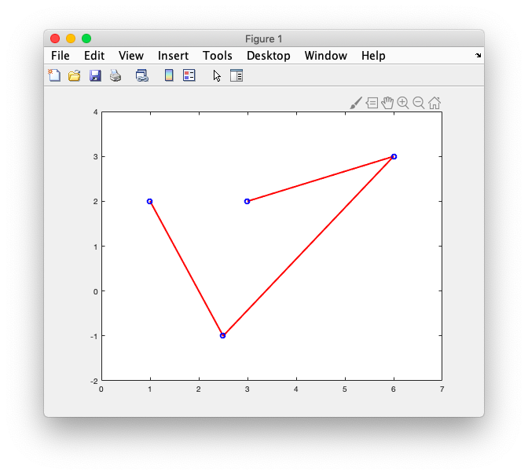
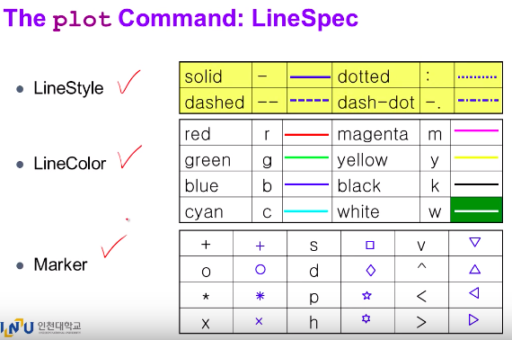
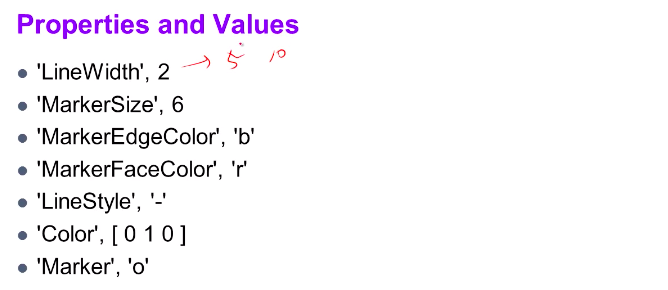
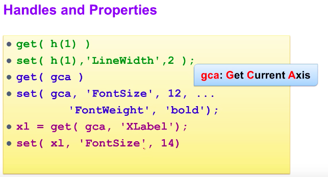
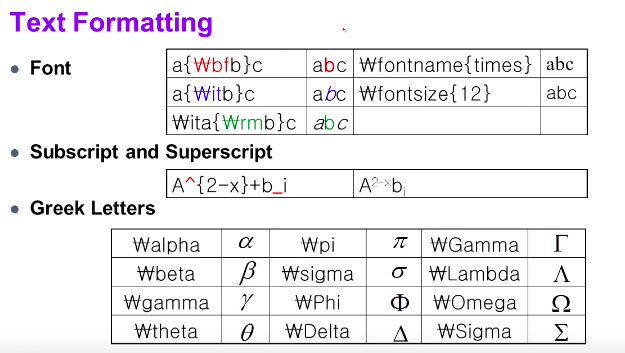

# 13. Graph property


### # property

```matlab
x = [1 2.5 6 3];
y = [2 -1 3 2];

plot(x,y, 'r-o', ... % red line, dot shape:o
'LineWidth',2,...
'MarkerEdgeColor','b'); %blue
axis([0 7 -2 +4]);
```











