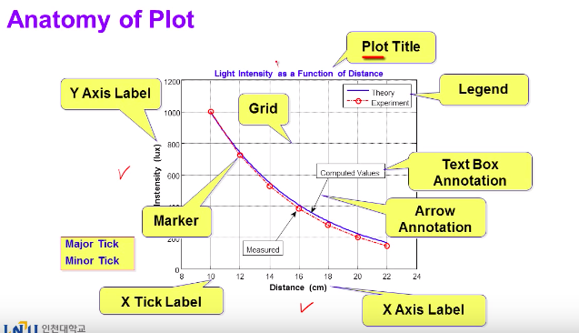
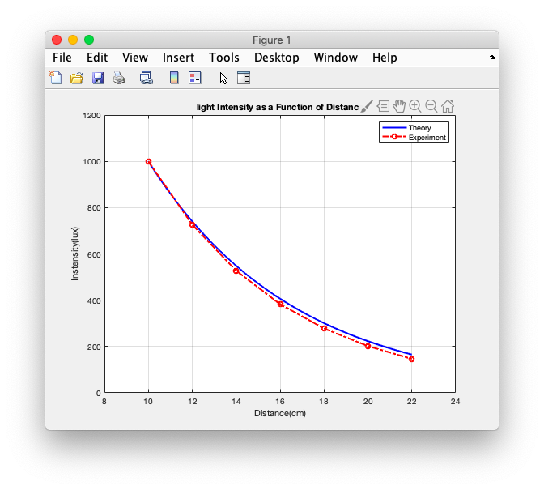
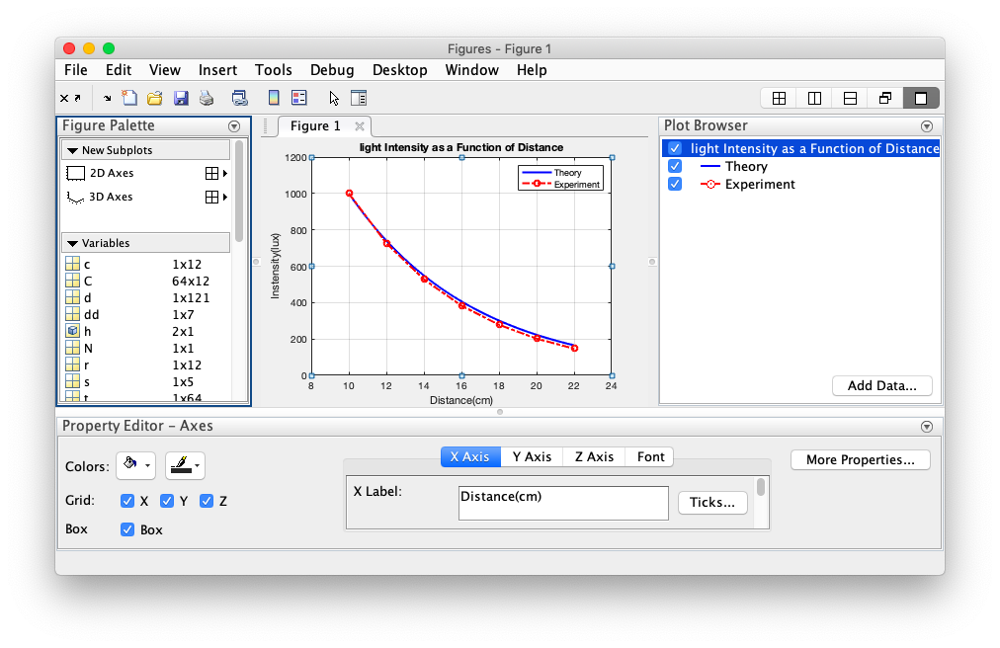
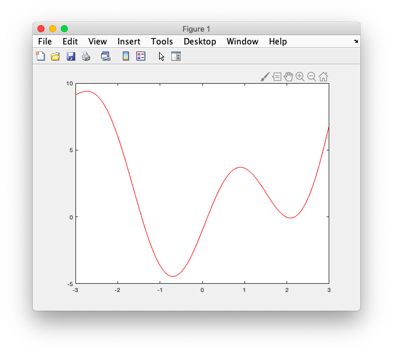
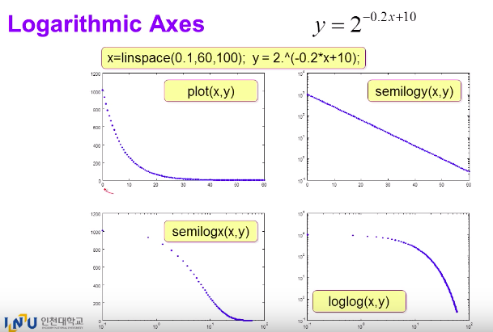

# 14. Graph custom, fplot, log scale




### # property

```matlab
d = 10:0.1:22;
dd = 10:2:22;

y = 1000*exp(-0.15*(d-10));
yy = 1000*exp(-0.16*(dd-10));

h = plot(d,y,'b-',dd,yy,'r-.o');
axis([8 24 0 1200]);

set(h(1),'LineWidth',2);
set(h(2),'LineWidth',2);

xlabel('Distance(cm)');
ylabel('Instensity(lux)');
title('light Intensity as a Function of Distance')
legend('Theory','Experiment')
grid;
```




- able to change property with tools

  


### # fplot : Function Plot 

```matlab
fplot('x.^2+4*sin(2*x)-1',[-3 3],'r-');
```

```matlab
x = -3:0.01:3;
y = x.^2+4*sin(2*x)-1;
figure(1);
plot(x,y,'r-');
minY = floor(min(y));
maxY = ceil(max(y));
axis([-3 3 minY maxY]);

```




### # How to change log scale

- only x, only y, or both

