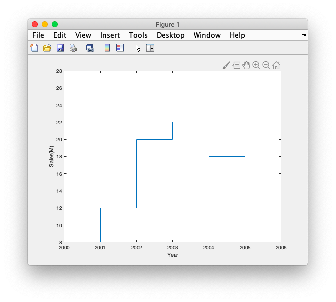

# 15.gragh bar, stair, stem, pie, polar


### # Bar

```matlab
year = 2000:2006;
sales = [8 12 20 22 18 24 27];
bar(year, sales, 'r');

xlabel('Year');
ylabel('Sales(M)');
```


### # stairs

```matlab
year = 2000:2006;
sales = [8 12 20 22 18 24 27];
stairs(year, sales);

xlabel('Year');
ylabel('Sales(M)');
```



### # stem

```matlab
year = 2000:2006;
sales = [8 12 20 22 18 24 27];
stem(year, sales,'filled');

xlabel('Year');
ylabel('Sales(M)');
```


### # pie

```matlab
grades = [11 18 26 9 5];
pie(grades, [0 0 0 1 0]);
title('Class grades');

```


### # Polar plot

```matlab
t = 0:0.01:pi/4;
th = [t 0 0];
r = [ones(1,length(t)),0,1];
h = polar(th,r,'r-');
set(h,'LineWidth',3);
```

### 