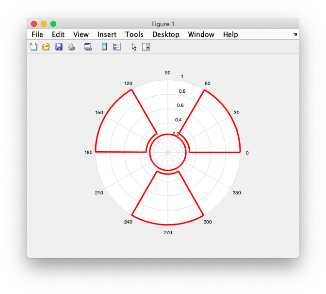
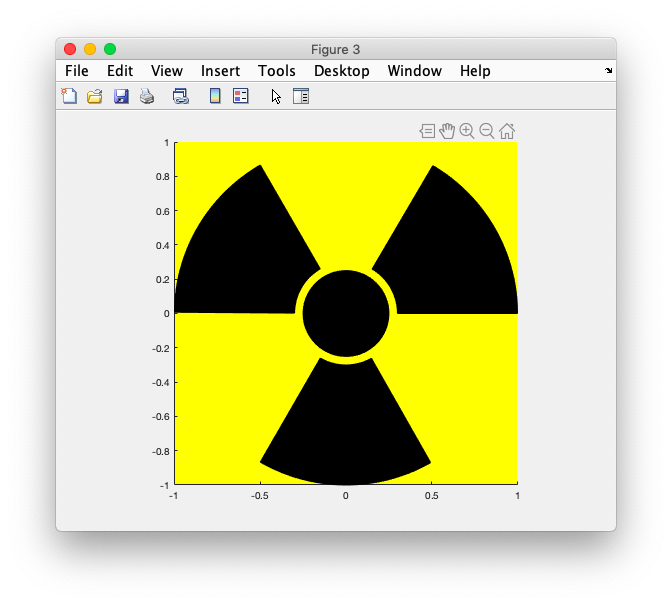
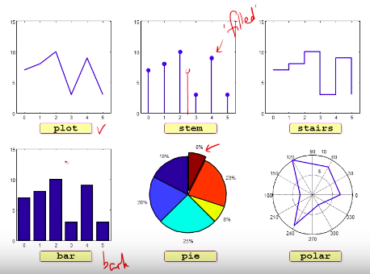

# 16.graph polar, patch, subplot


### # polar

```matlab
% polar, plot and patch demo
% a wing
t1 = 0:0.01:pi/3;
tr = t1(end:-1:1);
nt = length(t1);
th = [t1 tr 0];
r1 = [ones(1,nt) 0.3*ones(1,nt) 1];
%circle
t2 = 0: 0.01:2*pi;
r2 = ones(1,length(t2));

% polar
figure(1);
h1 = polar(th, r1, 'r-'); 
hold on;
h2 = polar(th+2/3*pi, r1, 'r-');
h3 = polar(th-2/3*pi, r1, 'r-');
h0 = polar(t2,0.25*r2,'r-');
set([h0 h1 h2 h3],'LineWidth',3);
hold off;

```



### # plot

```matlab
% plot
figure(2)
h1 = plot(r1.*cos(th), r1.*sin(th),'r-'); 
hold on;
h2 = plot(r1.*cos(th+2/3*pi), r1.*sin(th+2/3*pi),'r-');
h3 = plot(r1.*cos(th-2/3*pi), r1.*sin(th-2/3*pi),'r-');
h0 = plot(0.25 *r2.*cos(t2), 0.25*r2.*sin(t2),'r-');
set([h0 h1 h2 h3],'LineWidth',3);
axis square;
hold off;
```


### # patch

```matlab
% patch
figure(3)
h1 = patch(r1.*cos(th), r1.*sin(th),'k'); hold on;
h2 = patch(r1.*cos(th+2/3*pi), r1.*sin(th+2/3*pi),'k');
h3 = patch(r1.*cos(th-2/3*pi), r1.*sin(th-2/3*pi),'k');
h0 = patch(0.25 *r2.*cos(t2), 0.25*r2.*sin(t2),'k');
set(gca,'Color','yellow');
axis square;
hold off;
```




### # Sub plot

```matlab
%subplot demo
y = floor(10*rand(1,6))+3;
x = 1 : length(y);

subplot(2,3,1); plot(x,y,'b-'); axis([-0.5 5.5 0 15]);
subplot(2,3,2); stem(x,y,'filled');axis([-0.5 5.5 0 15]);
subplot(2,3,3); stairs(x,y,'b-');axis([-0.5 5.5 0 15]);
subplot(2,3,4); bar(x,y,0.75);axis([-0.5 5.5 0 15]);
subplot(2,3,5); pie(y,[0 0 0 0 1]);
subplot(2,3,6); polar([x x(1)]*2*pi/6,[y y(1)],'b-');
```

