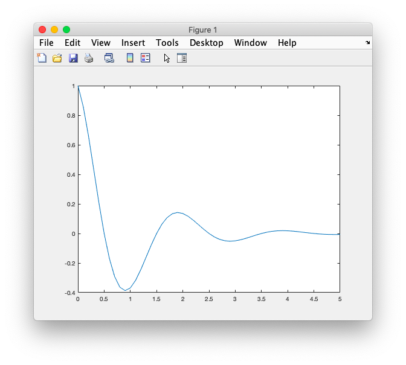
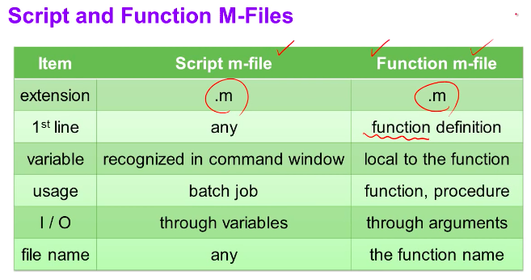
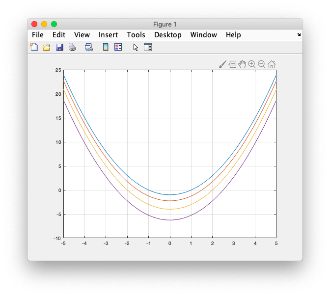
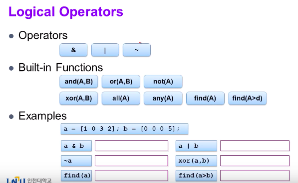

# 17. Function


### # example

- Save expcos.m

```matlab
function y = expcos(x)
y = exp(-abs(x)).*cos(pi*x); 
```

- In command

```matlab
>> expcos(4)

ans =

    0.0183
    
>> a = 0:0.1:5;   
>> plot(a,expcos(a))
```




### # script.m vs fucntion.m




### # Anonymous function

```matlab
f = @(a,b,x) (x-a).*(x-b);
x = -5:0.01:5;
a = 1:0.5:2.5;
b = -a;  

figure(1);
plot(x, f(a(1),b(1),x)); hold on;
plot(x, f(a(2),b(2),x));
plot(x, f(a(3),b(3),x));
plot(x, f(a(4),b(4),x)); hold off;
grid on;

```



### # sub function

```matlab

```


### # logical operators



