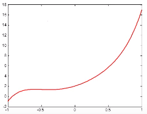
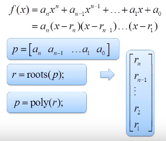
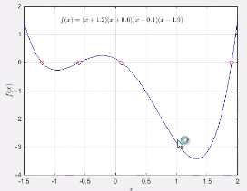

# 18.polynomials, bestfit, interpolation


### # polynomials

- Plotting

```matlab
%f(x) = 5x^5 + 6x^2 + 4x + 2
p =[5 0 0 6 4 2];

x0= 0;
y0 = polyval(p,x0);

x1 = [0 1];
y1 = polyval(p,x1);

x = linspace(-1, 2, 1000);
y = polyval(p,x);


figure(1);
plot(x,y,'b-',x1,y1,'ro');
grid on;

```



- Find root

```matlab
%f(x) = (x+1.2)(x+0.6)(x-0.1)(x-1.9)
r = [-1.2 -0.6 0.1 1.9];
p = poly(r);
```






- Addition, multiplication, division

```matlab
%% x^5 -5x^3 +4x 
p1 = [1 0 -5 0 4 0];
p2 = [0 0 0 1 2 0];

%%addition
pa = p1 + p2;

%%multiplication
pm = conv(p1, p2);

%%division
%p1 = p2 * q + r
[q, r] = deconv(p1,p2);


```

