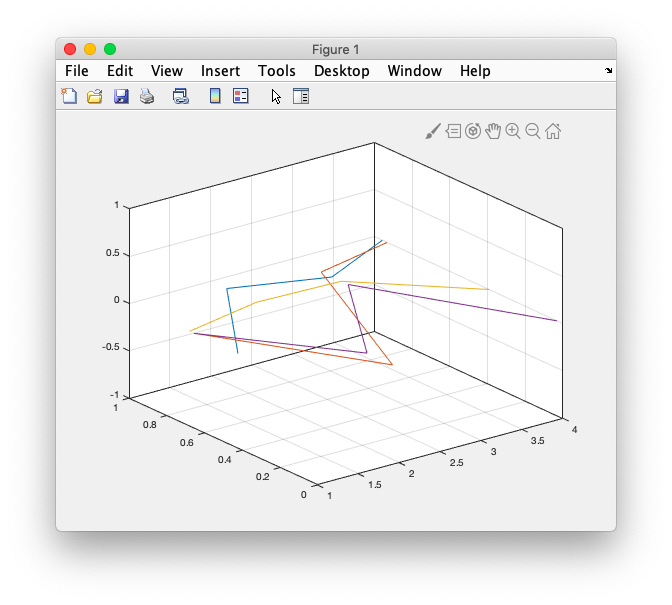
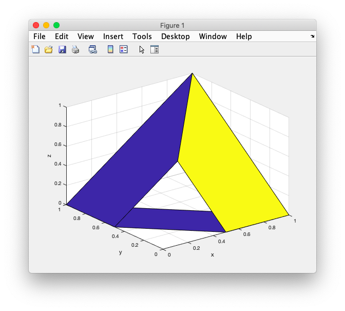
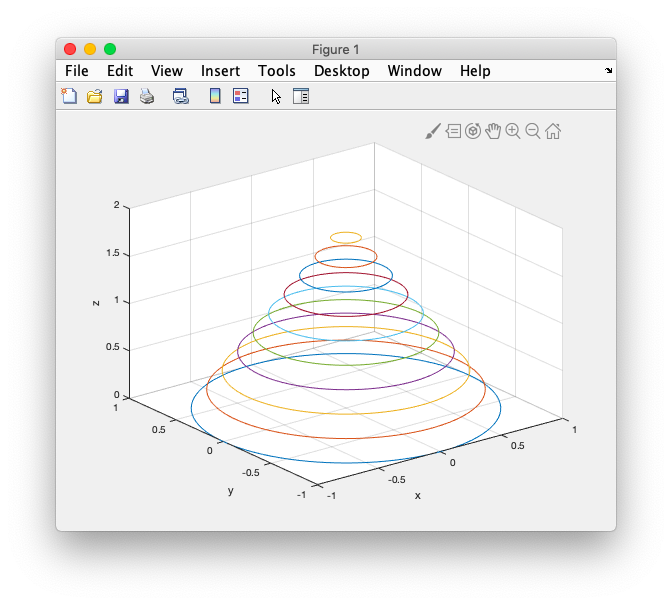
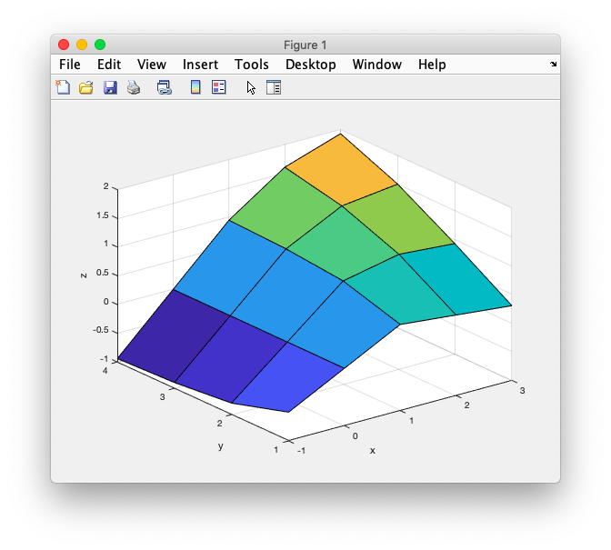

# 19. 3D graph


### # basic

```matlab
figure(1);
plot(rand(4));
grid on;
view(3);
```



### # plot3

```matlab
x = [1 0 1 1];
y = [0 1 1 0];
z = [0 0 1 0];

figure(1);
plot3(x, y, z); 
grid on;
xlabel('x');
xlabel('y');
xlabel('z');

hold on;
plot3(x*0.5, y*0.5, z*0.5); 
hold off;
```


### # 3D Surface Plot

```matlab
x1 = [1 0 1 1]';
y1 = [0 1 1 0]';
z1 = [0 0 1 0]';

%surface cordinator
X = [x1, 0.5*x1];
Y = [y1, 0.5*y1];
Z = [z1, 0.5*z1];

%surface that connects 2 triangle
figure(1);
surf( X, Y, Z );
grid on;
xlabel('x'); ylabel('y'); zlabel('z');
```




### # Cone

```matlab
t = linspace(0, 2*pi, 100)';
x = cos(t);
y = sin(t);
z = ones(size(x));
r = (1:-0.1:0);
h = 2 * (0:0.1:1);
X = x * r; %100x1 x 1x100 = 100 x 100
Y = y * r;
Z = z * h;

figure(1);
plot3(X,Y,Z);
grid on;
xlabel('x');
ylabel('y');
zlabel('z');
```




### # Mesh, surf

```matlab
x = -1:3;
y = 1:4;
[X, Y] = meshgrid(x,y);
Z = X .* Y.^2 ./ (X.^2 + Y.^2);
figure(1);
%mesh(X,Y,Z);
surf(X,Y,Z);
xlabel('x');
ylabel('y');
zlabel('z');

```




### # 19:02

```matlab

```


