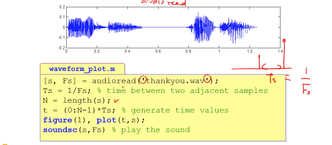

# 2.array, soundwaveform


### # code

```matlab

  Columns 460949 through 460952

   10.4523   10.4524   10.4524   10.4524

  Columns 460953 through 460956

   10.4524   10.4524   10.4525   10.4525

  Columns 460957 through 460960

   10.4525   10.4525   10.4526   10.4526

  Columns 460961 through 460964

   10.4526   10.4526   10.4527   10.4527

  Columns 460965 through 460968

   10.4527   10.4527   10.4527   10.4528

  Columns 460969 through 460972

   10.4528   10.4528   10.4528   10.4529

  Columns 460973 through 460976

   10.4529   10.4529   10.4529   10.4529

  Columns 460977 through 460980

   10.4530   10.4530   10.4530   10.4530

  Columns 460981 through 460984

   10.4531   10.4531   10.4531   10.4531

  Columns 460985 through 460988

   10.4532   10.4532   10.4532   10.4532

  Columns 460989 through 460992

   10.4532   10.4533   10.4533   10.4533

  Columns 460993 through 460996

   10.4533   10.4534   10.4534   10.4534

  Columns 460997 through 461000

   10.4534   10.4534   10.4535   10.4535

  Columns 461001 through 461004

   10.4535   10.4535   10.4536   10.4536

  Columns 461005 through 461008

   10.4536   10.4536   10.4537   10.4537

  Columns 461009 through 461012

   10.4537   10.4537   10.4537   10.4538

  Columns 461013 through 461016

   10.4538   10.4538   10.4538   10.4539

  Columns 461017 through 461020

   10.4539   10.4539   10.4539   10.4539

  Columns 461021 through 461024

   10.4540   10.4540   10.4540   10.4540

  Columns 461025 through 461028

   10.4541   10.4541   10.4541   10.4541

  Columns 461029 through 461032

   10.4541   10.4542   10.4542   10.4542

  Columns 461033 through 461036

   10.4542   10.4543   10.4543   10.4543

  Columns 461037 through 461040

   10.4543   10.4544   10.4544   10.4544

  Columns 461041 through 461044

   10.4544   10.4544   10.4545   10.4545

  Columns 461045 through 461048

   10.4545   10.4545   10.4546   10.4546

  Columns 461049 through 461052

   10.4546   10.4546   10.4546   10.4547

  Columns 461053 through 461056

   10.4547   10.4547   10.4547   10.4548

  Columns 461057 through 461060

   10.4548   10.4548   10.4548   10.4549

  Columns 461061 through 461064

   10.4549   10.4549   10.4549   10.4549

  Columns 461065 through 461068

   10.4550   10.4550   10.4550   10.4550

  Columns 461069 through 461072

   10.4551   10.4551   10.4551   10.4551

  Columns 461073 through 461076

   10.4551   10.4552   10.4552   10.4552

  Columns 461077 through 461080

   10.4552   10.4553   10.4553   10.4553

  Columns 461081 through 461084

   10.4553   10.4554   10.4554   10.4554

  Columns 461085 through 461088

   10.4554   10.4554   10.4555   10.4555

  Columns 461089 through 461092

   10.4555   10.4555   10.4556   10.4556

  Columns 461093 through 461096

   10.4556   10.4556   10.4556   10.4557

  Columns 461097 through 461100

   10.4557   10.4557   10.4557   10.4558

  Columns 461101 through 461104

   10.4558   10.4558   10.4558   10.4559

  Columns 461105 through 461108

   10.4559   10.4559   10.4559   10.4559

  Columns 461109 through 461112

   10.4560   10.4560   10.4560   10.4560

  Columns 461113 through 461116

   10.4561   10.4561   10.4561   10.4561

  Columns 461117 through 461120

   10.4561   10.4562   10.4562   10.4562

  Columns 461121 through 461124

   10.4562   10.4563   10.4563   10.4563

  Columns 461125 through 461128

   10.4563   10.4563   10.4564   10.4564

  Columns 461129 through 461132

   10.4564   10.4564   10.4565   10.4565

  Columns 461133 through 461136

   10.4565   10.4565   10.4566   10.4566

  Columns 461137 through 461140

   10.4566   10.4566   10.4566   10.4567

  Columns 461141 through 461144

   10.4567   10.4567   10.4567   10.4568

  Columns 461145 through 461148

   10.4568   10.4568   10.4568   10.4568

  Columns 461149 through 461152

   10.4569   10.4569   10.4569   10.4569

  Columns 461153 through 461156

   10.4570   10.4570   10.4570   10.4570

  Columns 461157 through 461160

   10.4571   10.4571   10.4571   10.4571

  Columns 461161 through 461164

   10.4571   10.4572   10.4572   10.4572

  Columns 461165 through 461168

   10.4572   10.4573   10.4573   10.4573

  Columns 461169 through 461172

   10.4573   10.4573   10.4574   10.4574

  Columns 461173 through 461176

   10.4574   10.4574   10.4575   10.4575

  Columns 461177 through 461180

   10.4575   10.4575   10.4576   10.4576

  Columns 461181 through 461184

   10.4576   10.4576   10.4576   10.4577

  Columns 461185 through 461188

   10.4577   10.4577   10.4577   10.4578

  Columns 461189 through 461192

   10.4578   10.4578   10.4578   10.4578

  Columns 461193 through 461196

   10.4579   10.4579   10.4579   10.4579

  Columns 461197 through 461200

   10.4580   10.4580   10.4580   10.4580

  Columns 461201 through 461204

   10.4580   10.4581   10.4581   10.4581

  Columns 461205 through 461208

   10.4581   10.4582   10.4582   10.4582

  Columns 461209 through 461212

   10.4582   10.4583   10.4583   10.4583

  Columns 461213 through 461216

   10.4583   10.4583   10.4584   10.4584

  Columns 461217 through 461220

   10.4584   10.4584   10.4585   10.4585

  Columns 461221 through 461224

   10.4585   10.4585   10.4585   10.4586

  Columns 461225 through 461228

   10.4586   10.4586   10.4586   10.4587

  Columns 461229 through 461232

   10.4587   10.4587   10.4587   10.4588

  Columns 461233 through 461236

   10.4588   10.4588   10.4588   10.4588

  Columns 461237 through 461240

   10.4589   10.4589   10.4589   10.4589

  Columns 461241 through 461244

   10.4590   10.4590   10.4590   10.4590

  Columns 461245 through 461248

   10.4590   10.4591   10.4591   10.4591

  Columns 461249 through 461252

   10.4591   10.4592   10.4592   10.4592

  Columns 461253 through 461256

   10.4592   10.4593   10.4593   10.4593

  Columns 461257 through 461260

   10.4593   10.4593   10.4594   10.4594

  Columns 461261 through 461264

   10.4594   10.4594   10.4595   10.4595

  Columns 461265 through 461268

   10.4595   10.4595   10.4595   10.4596

  Columns 461269 through 461272

   10.4596   10.4596   10.4596   10.4597

  Columns 461273 through 461276

   10.4597   10.4597   10.4597   10.4598

  Columns 461277 through 461280

   10.4598   10.4598   10.4598   10.4598

  Columns 461281 through 461284

   10.4599   10.4599   10.4599   10.4599

  Columns 461285 through 461288

   10.4600   10.4600   10.4600   10.4600

  Columns 461289 through 461292

   10.4600   10.4601   10.4601   10.4601

  Columns 461293 through 461296

   10.4601   10.4602   10.4602   10.4602

  Columns 461297 through 461300

   10.4602   10.4602   10.4603   10.4603

  Columns 461301 through 461304

   10.4603   10.4603   10.4604   10.4604

  Columns 461305 through 461308

   10.4604   10.4604   10.4605   10.4605

  Columns 461309 through 461312

   10.4605   10.4605   10.4605   10.4606

  Columns 461313 through 461316

   10.4606   10.4606   10.4606   10.4607

  Columns 461317 through 461320

   10.4607   10.4607   10.4607   10.4607

  Columns 461321 through 461324

   10.4608   10.4608   10.4608   10.4608

  Columns 461325 through 461328

   10.4609   10.4609   10.4609   10.4609

  Columns 461329 through 461332

   10.4610   10.4610   10.4610   10.4610

  Columns 461333 through 461336

   10.4610   10.4611   10.4611   10.4611

  Columns 461337 through 461340

   10.4611   10.4612   10.4612   10.4612

  Columns 461341 through 461344

   10.4612   10.4612   10.4613   10.4613

  Columns 461345 through 461348

   10.4613   10.4613   10.4614   10.4614

  Columns 461349 through 461352

   10.4614   10.4614   10.4615   10.4615

  Columns 461353 through 461356

   10.4615   10.4615   10.4615   10.4616

  Columns 461357 through 461360

   10.4616   10.4616   10.4616   10.4617

  Columns 461361 through 461364

   10.4617   10.4617   10.4617   10.4617

  Columns 461365 through 461368

   10.4618   10.4618   10.4618   10.4618

  Columns 461369 through 461372

   10.4619   10.4619   10.4619   10.4619

  Columns 461373 through 461376

   10.4620   10.4620   10.4620   10.4620

  Columns 461377 through 461380

   10.4620   10.4621   10.4621   10.4621

  Columns 461381 through 461384

   10.4621   10.4622   10.4622   10.4622

  Columns 461385 through 461388

   10.4622   10.4622   10.4623   10.4623

  Columns 461389 through 461392

   10.4623   10.4623   10.4624   10.4624

  Columns 461393 through 461396

   10.4624   10.4624   10.4624   10.4625

  Columns 461397 through 461400

   10.4625   10.4625   10.4625   10.4626

  Columns 461401 through 461404

   10.4626   10.4626   10.4626   10.4627

  Columns 461405 through 461408

   10.4627   10.4627   10.4627   10.4627

  Columns 461409 through 461412

   10.4628   10.4628   10.4628   10.4628

  Columns 461413 through 461416

   10.4629   10.4629   10.4629   10.4629

  Columns 461417 through 461420

   10.4629   10.4630   10.4630   10.4630

  Columns 461421 through 461424

   10.4630   10.4631   10.4631   10.4631

  Columns 461425 through 461428

   10.4631   10.4632   10.4632   10.4632

  Columns 461429 through 461432

   10.4632   10.4632   10.4633   10.4633

  Columns 461433 through 461436

   10.4633   10.4633   10.4634   10.4634

  Columns 461437 through 461440

   10.4634   10.4634   10.4634   10.4635

  Columns 461441 through 461444

   10.4635   10.4635   10.4635   10.4636

  Columns 461445 through 461448

   10.4636   10.4636   10.4636   10.4637

  Columns 461449 through 461452

   10.4637   10.4637   10.4637   10.4637

  Columns 461453 through 461456

   10.4638   10.4638   10.4638   10.4638

  Columns 461457 through 461460

   10.4639   10.4639   10.4639   10.4639

  Columns 461461 through 461464

   10.4639   10.4640   10.4640   10.4640

  Columns 461465 through 461468

   10.4640   10.4641   10.4641   10.4641

  Columns 461469 through 461472

   10.4641   10.4641   10.4642   10.4642

  Columns 461473 through 461476

   10.4642   10.4642   10.4643   10.4643

  Columns 461477 through 461480

   10.4643   10.4643   10.4644   10.4644

  Columns 461481 through 461484

   10.4644   10.4644   10.4644   10.4645

  Columns 461485 through 461488

   10.4645   10.4645   10.4645   10.4646

  Columns 461489 through 461492

   10.4646   10.4646   10.4646   10.4646

  Columns 461493 through 461496

   10.4647   10.4647   10.4647   10.4647

  Columns 461497 through 461500

   10.4648   10.4648   10.4648   10.4648

  Columns 461501 through 461504

   10.4649   10.4649   10.4649   10.4649

  Columns 461505 through 461508

   10.4649   10.4650   10.4650   10.4650

  Columns 461509 through 461512

   10.4650   10.4651   10.4651   10.4651

  Columns 461513 through 461516

   10.4651   10.4651   10.4652   10.4652

  Columns 461517 through 461520

   10.4652   10.4652   10.4653   10.4653

  Columns 461521 through 461524

   10.4653   10.4653   10.4654   10.4654

  Columns 461525 through 461528

   10.4654   10.4654   10.4654   10.4655

  Columns 461529 through 461532

   10.4655   10.4655   10.4655   10.4656

  Columns 461533 through 461536

   10.4656   10.4656   10.4656   10.4656

  Columns 461537 through 461540

   10.4657   10.4657   10.4657   10.4657

  Columns 461541 through 461544

   10.4658   10.4658   10.4658   10.4658

  Columns 461545 through 461548

   10.4659   10.4659   10.4659   10.4659

  Columns 461549 through 461552

   10.4659   10.4660   10.4660   10.4660

  Columns 461553 through 461556

   10.4660   10.4661   10.4661   10.4661

  Columns 461557 through 461560

   10.4661   10.4661   10.4662   10.4662

  Columns 461561 through 461564

   10.4662   10.4662   10.4663   10.4663

  Columns 461565 through 461568

   10.4663   10.4663   10.4663   10.4664

  Columns 461569 through 461572

   10.4664   10.4664   10.4664   10.4665

  Columns 461573 through 461576

   10.4665   10.4665   10.4665   10.4666

  Columns 461577 through 461580

   10.4666   10.4666   10.4666   10.4666

  Columns 461581 through 461584

   10.4667   10.4667   10.4667   10.4667

  Columns 461585 through 461588

   10.4668   10.4668   10.4668   10.4668

  Columns 461589 through 461592

   10.4668   10.4669   10.4669   10.4669

  Columns 461593 through 461596

   10.4669   10.4670   10.4670   10.4670

  Columns 461597 through 461600

   10.4670   10.4671   10.4671   10.4671

  Columns 461601 through 461604

   10.4671   10.4671   10.4672   10.4672

  Columns 461605 through 461608

   10.4672   10.4672   10.4673   10.4673

  Columns 461609 through 461612

   10.4673   10.4673   10.4673   10.4674

  Columns 461613 through 461616

   10.4674   10.4674   10.4674   10.4675

  Columns 461617 through 461620

   10.4675   10.4675   10.4675   10.4676

  Columns 461621 through 461624

   10.4676   10.4676   10.4676   10.4676

  Columns 461625 through 461628

   10.4677   10.4677   10.4677   10.4677

  Columns 461629 through 461632

   10.4678   10.4678   10.4678   10.4678

  Columns 461633 through 461636

   10.4678   10.4679   10.4679   10.4679

  Columns 461637 through 461640

   10.4679   10.4680   10.4680   10.4680

  Columns 461641 through 461644

   10.4680   10.4680   10.4681   10.4681

  Columns 461645 through 461648

   10.4681   10.4681   10.4682   10.4682

  Columns 461649 through 461652

   10.4682   10.4682   10.4683   10.4683

  Columns 461653 through 461656

   10.4683   10.4683   10.4683   10.4684

  Columns 461657 through 461660

   10.4684   10.4684   10.4684   10.4685

  Columns 461661 through 461664

   10.4685   10.4685   10.4685   10.4685

  Columns 461665 through 461668

   10.4686   10.4686   10.4686   10.4686

  Columns 461669 through 461672

   10.4687   10.4687   10.4687   10.4687

  Columns 461673 through 461676

   10.4688   10.4688   10.4688   10.4688

  Columns 461677 through 461680

   10.4688   10.4689   10.4689   10.4689

  Columns 461681 through 461684

   10.4689   10.4690   10.4690   10.4690

  Columns 461685 through 461688

   10.4690   10.4690   10.4691   10.4691

  Columns 461689 through 461692

   10.4691   10.4691   10.4692   10.4692

  Columns 461693 through 461696

   10.4692   10.4692   10.4693   10.4693

  Columns 461697 through 461700

   10.4693   10.4693   10.4693   10.4694

  Columns 461701 through 461704

   10.4694   10.4694   10.4694   10.4695

  Columns 461705 through 461708

   10.4695   10.4695   10.4695   10.4695

  Columns 461709 through 461712

   10.4696   10.4696   10.4696   10.4696

  Columns 461713 through 461716

   10.4697   10.4697   10.4697   10.4697

  Columns 461717 through 461720

   10.4698   10.4698   10.4698   10.4698

  Columns 461721 through 461724

   10.4698   10.4699   10.4699   10.4699

  Columns 461725 through 461728

   10.4699   10.4700   10.4700   10.4700

  Columns 461729 through 461732

   10.4700   10.4700   10.4701   10.4701

  Columns 461733 through 461736

   10.4701   10.4701   10.4702   10.4702

  Columns 461737 through 461740

   10.4702   10.4702   10.4702   10.4703

  Columns 461741 through 461744

   10.4703   10.4703   10.4703   10.4704

  Columns 461745 through 461748

   10.4704   10.4704   10.4704   10.4705

  Columns 461749 through 461752

   10.4705   10.4705   10.4705   10.4705

  Columns 461753 through 461756

   10.4706   10.4706   10.4706   10.4706

  Columns 461757 through 461760

   10.4707   10.4707   10.4707   10.4707

  Columns 461761 through 461764

   10.4707   10.4708   10.4708   10.4708

  Columns 461765 through 461768

   10.4708   10.4709   10.4709   10.4709

  Columns 461769 through 461772

   10.4709   10.4710   10.4710   10.4710

  Columns 461773 through 461776

   10.4710   10.4710   10.4711   10.4711

  Columns 461777 through 461780

   10.4711   10.4711   10.4712   10.4712

  Columns 461781 through 461784

   10.4712   10.4712   10.4712   10.4713

  Columns 461785 through 461788

   10.4713   10.4713   10.4713   10.4714

  Columns 461789 through 461792

   10.4714   10.4714   10.4714   10.4715

  Columns 461793 through 461796

   10.4715   10.4715   10.4715   10.4715

  Columns 461797 through 461800

   10.4716   10.4716   10.4716   10.4716

  Columns 461801 through 461804

   10.4717   10.4717   10.4717   10.4717

  Columns 461805 through 461808

   10.4717   10.4718   10.4718   10.4718

  Columns 461809 through 461812

   10.4718   10.4719   10.4719   10.4719

  Columns 461813 through 461816

   10.4719   10.4720   10.4720   10.4720

  Columns 461817 through 461820

   10.4720   10.4720   10.4721   10.4721

  Columns 461821 through 461824

   10.4721   10.4721   10.4722   10.4722

  Columns 461825 through 461828

   10.4722   10.4722   10.4722   10.4723

  Columns 461829 through 461832

   10.4723   10.4723   10.4723   10.4724

  Columns 461833 through 461836

   10.4724   10.4724   10.4724   10.4724

  Columns 461837 through 461840

   10.4725   10.4725   10.4725   10.4725

  Columns 461841 through 461844

   10.4726   10.4726   10.4726   10.4726

  Columns 461845 through 461848

   10.4727   10.4727   10.4727   10.4727

  Columns 461849 through 461852

   10.4727   10.4728   10.4728   10.4728

  Columns 461853 through 461856

   10.4728   10.4729   10.4729   10.4729

  Columns 461857 through 461860

   10.4729   10.4729   10.4730   10.4730

  Columns 461861 through 461864

   10.4730   10.4730   10.4731   10.4731

  Columns 461865 through 461868

   10.4731   10.4731   10.4732   10.4732

  Columns 461869 through 461872

   10.4732   10.4732   10.4732   10.4733

  Columns 461873 through 461876

   10.4733   10.4733   10.4733   10.4734

  Columns 461877 through 461880

   10.4734   10.4734   10.4734   10.4734

  Columns 461881 through 461884

   10.4735   10.4735   10.4735   10.4735

  Columns 461885 through 461888

   10.4736   10.4736   10.4736   10.4736

  Columns 461889 through 461892

   10.4737   10.4737   10.4737   10.4737

  Columns 461893 through 461896

   10.4737   10.4738   10.4738   10.4738

  Columns 461897 through 461900

   10.4738   10.4739   10.4739   10.4739

  Columns 461901 through 461904

   10.4739   10.4739   10.4740   10.4740

  Columns 461905 through 461908

   10.4740   10.4740   10.4741   10.4741

  Columns 461909 through 461912

   10.4741   10.4741   10.4741   10.4742

  Columns 461913 through 461916

   10.4742   10.4742   10.4742   10.4743

  Columns 461917 through 461920

   10.4743   10.4743   10.4743   10.4744

  Columns 461921 through 461924

   10.4744   10.4744   10.4744   10.4744

  Columns 461925 through 461928

   10.4745   10.4745   10.4745   10.4745

  Columns 461929 through 461932

   10.4746   10.4746   10.4746   10.4746

  Columns 461933 through 461936

   10.4746   10.4747   10.4747   10.4747

  Columns 461937 through 461940

   10.4747   10.4748   10.4748   10.4748

  Columns 461941 through 461944

   10.4748   10.4749   10.4749   10.4749

  Columns 461945 through 461948

   10.4749   10.4749   10.4750   10.4750

  Columns 461949 through 461952

   10.4750   10.4750   10.4751   10.4751

  Columns 461953 through 461956

   10.4751   10.4751   10.4751   10.4752

  Columns 461957 through 461960

   10.4752   10.4752   10.4752   10.4753

  Columns 461961 through 461964

   10.4753   10.4753   10.4753   10.4754

  Columns 461965 through 461968

   10.4754   10.4754   10.4754   10.4754

  Columns 461969 through 461972

   10.4755   10.4755   10.4755   10.4755

  Columns 461973 through 461976

   10.4756   10.4756   10.4756   10.4756

  Columns 461977 through 461980

   10.4756   10.4757   10.4757   10.4757

  Columns 461981 through 461984

   10.4757   10.4758   10.4758   10.4758

  Columns 461985 through 461988

   10.4758   10.4759   10.4759   10.4759

  Columns 461989 through 461992

   10.4759   10.4759   10.4760   10.4760

  Columns 461993 through 461996

   10.4760   10.4760   10.4761   10.4761

  Columns 461997 through 462000

   10.4761   10.4761   10.4761   10.4762

  Columns 462001 through 462004

   10.4762   10.4762   10.4762   10.4763

  Columns 462005 through 462008

   10.4763   10.4763   10.4763   10.4763

  Columns 462009 through 462012

   10.4764   10.4764   10.4764   10.4764

  Columns 462013 through 462016

   10.4765   10.4765   10.4765   10.4765

  Columns 462017 through 462020

   10.4766   10.4766   10.4766   10.4766

  Columns 462021 through 462024

   10.4766   10.4767   10.4767   10.4767

  Columns 462025 through 462028

   10.4767   10.4768   10.4768   10.4768

  Columns 462029 through 462032

   10.4768   10.4768   10.4769   10.4769

  Columns 462033 through 462036

   10.4769   10.4769   10.4770   10.4770

  Columns 462037 through 462040

   10.4770   10.4770   10.4771   10.4771

  Columns 462041 through 462044

   10.4771   10.4771   10.4771   10.4772

  Columns 462045 through 462048

   10.4772   10.4772   10.4772   10.4773

  Columns 462049 through 462052

   10.4773   10.4773   10.4773   10.4773

  Columns 462053 through 462056

   10.4774   10.4774   10.4774   10.4774

  Columns 462057 through 462060

   10.4775   10.4775   10.4775   10.4775

  Columns 462061 through 462064

   10.4776   10.4776   10.4776   10.4776

  Columns 462065 through 462068

   10.4776   10.4777   10.4777   10.4777

  Columns 462069 through 462072

   10.4777   10.4778   10.4778   10.4778

  Columns 462073 through 462076

   10.4778   10.4778   10.4779   10.4779

  Columns 462077 through 462080

   10.4779   10.4779   10.4780   10.4780

  Columns 462081 through 462084

   10.4780   10.4780   10.4780   10.4781

  Columns 462085 through 462088

   10.4781   10.4781   10.4781   10.4782

  Columns 462089 through 462092

   10.4782   10.4782   10.4782   10.4783

  Columns 462093 through 462096

   10.4783   10.4783   10.4783   10.4783

  Columns 462097 through 462100

   10.4784   10.4784   10.4784   10.4784

  Columns 462101 through 462104

   10.4785   10.4785   10.4785   10.4785

  Columns 462105 through 462108

   10.4785   10.4786   10.4786   10.4786

  Columns 462109 through 462112

   10.4786   10.4787   10.4787   10.4787

  Columns 462113 through 462116

   10.4787   10.4788   10.4788   10.4788

  Columns 462117 through 462120

   10.4788   10.4788   10.4789   10.4789

  Columns 462121 through 462124

   10.4789   10.4789   10.4790   10.4790

  Columns 462125 through 462128

   10.4790   10.4790   10.4790   10.4791

  Columns 462129 through 462132

   10.4791   10.4791   10.4791   10.4792

  Columns 462133 through 462136

   10.4792   10.4792   10.4792   10.4793

  Columns 462137 through 462140

   10.4793   10.4793   10.4793   10.4793

  Columns 462141 through 462144

   10.4794   10.4794   10.4794   10.4794

  Columns 462145 through 462148

   10.4795   10.4795   10.4795   10.4795

  Columns 462149 through 462152

   10.4795   10.4796   10.4796   10.4796

  Columns 462153 through 462156

   10.4796   10.4797   10.4797   10.4797

  Columns 462157 through 462160

   10.4797   10.4798   10.4798   10.4798

  Columns 462161 through 462164

   10.4798   10.4798   10.4799   10.4799

  Columns 462165 through 462168

   10.4799   10.4799   10.4800   10.4800

  Columns 462169 through 462172

   10.4800   10.4800   10.4800   10.4801

  Columns 462173 through 462176

   10.4801   10.4801   10.4801   10.4802

  Columns 462177 through 462180

   10.4802   10.4802   10.4802   10.4802

  Columns 462181 through 462184

   10.4803   10.4803   10.4803   10.4803

  Columns 462185 through 462188

   10.4804   10.4804   10.4804   10.4804

  Columns 462189 through 462192

   10.4805   10.4805   10.4805   10.4805

  Columns 462193 through 462196

   10.4805   10.4806   10.4806   10.4806

  Columns 462197 through 462200

   10.4806   10.4807   10.4807   10.4807

  Columns 462201 through 462204

   10.4807   10.4807   10.4808   10.4808

  Columns 462205 through 462208

   10.4808   10.4808   10.4809   10.4809

  Columns 462209 through 462212

   10.4809   10.4809   10.4810   10.4810

  Columns 462213 through 462216

   10.4810   10.4810   10.4810   10.4811

  Columns 462217 through 462220

   10.4811   10.4811   10.4811   10.4812

  Columns 462221 through 462224

   10.4812   10.4812   10.4812   10.4812

  Columns 462225 through 462228

   10.4813   10.4813   10.4813   10.4813

  Columns 462229 through 462232

   10.4814   10.4814   10.4814   10.4814

  Columns 462233 through 462236

   10.4815   10.4815   10.4815   10.4815

  Columns 462237 through 462240

   10.4815   10.4816   10.4816   10.4816

  Columns 462241 through 462244

   10.4816   10.4817   10.4817   10.4817

  Columns 462245 through 462248

   10.4817   10.4817   10.4818   10.4818

  Columns 462249 through 462252

   10.4818   10.4818   10.4819   10.4819

  Columns 462253 through 462256

   10.4819   10.4819   10.4820   10.4820

  Columns 462257 through 462260

   10.4820   10.4820   10.4820   10.4821

  Columns 462261 through 462264

   10.4821   10.4821   10.4821   10.4822

  Columns 462265 through 462268

   10.4822   10.4822   10.4822   10.4822

  Columns 462269 through 462272

   10.4823   10.4823   10.4823   10.4823

  Columns 462273 through 462276

   10.4824   10.4824   10.4824   10.4824

  Columns 462277 through 462280

   10.4824   10.4825   10.4825   10.4825

  Columns 462281 through 462284

   10.4825   10.4826   10.4826   10.4826

  Columns 462285 through 462288

   10.4826   10.4827   10.4827   10.4827

  Columns 462289 through 462292

   10.4827   10.4827   10.4828   10.4828

  Columns 462293 through 462296

   10.4828   10.4828   10.4829   10.4829

  Columns 462297 through 462300

   10.4829   10.4829   10.4829   10.4830

  Columns 462301 through 462304

   10.4830   10.4830   10.4830   10.4831

  Columns 462305 through 462308

   10.4831   10.4831   10.4831   10.4832

  Columns 462309 through 462312

   10.4832   10.4832   10.4832   10.4832

  Columns 462313 through 462316

   10.4833   10.4833   10.4833   10.4833

  Columns 462317 through 462320

   10.4834   10.4834   10.4834   10.4834

  Columns 462321 through 462324

   10.4834   10.4835   10.4835   10.4835

  Columns 462325 through 462328

   10.4835   10.4836   10.4836   10.4836

  Columns 462329 through 462332

   10.4836   10.4837   10.4837   10.4837

  Columns 462333 through 462336

   10.4837   10.4837   10.4838   10.4838

  Columns 462337 through 462340

   10.4838   10.4838   10.4839   10.4839

  Columns 462341 through 462344

   10.4839   10.4839   10.4839   10.4840

  Columns 462345 through 462348

   10.4840   10.4840   10.4840   10.4841

  Columns 462349 through 462352

   10.4841   10.4841   10.4841   10.4841

  Columns 462353 through 462356

   10.4842   10.4842   10.4842   10.4842

  Columns 462357 through 462360

   10.4843   10.4843   10.4843   10.4843

  Columns 462361 through 462364

   10.4844   10.4844   10.4844   10.4844

  Columns 462365 through 462368

   10.4844   10.4845   10.4845   10.4845

  Columns 462369 through 462372

   10.4845   10.4846   10.4846   10.4846

  Columns 462373 through 462376

   10.4846   10.4846   10.4847   10.4847

  Columns 462377 through 462380

   10.4847   10.4847   10.4848   10.4848

  Columns 462381 through 462384

   10.4848   10.4848   10.4849   10.4849

  Columns 462385 through 462388

   10.4849   10.4849   10.4849   10.4850

  Columns 462389 through 462392

   10.4850   10.4850   10.4850   10.4851

  Columns 462393 through 462396

   10.4851   10.4851   10.4851   10.4851

  Columns 462397 through 462400

   10.4852   10.4852   10.4852   10.4852

  Columns 462401 through 462404

   10.4853   10.4853   10.4853   10.4853

  Columns 462405 through 462408

   10.4854   10.4854   10.4854   10.4854

  Columns 462409 through 462412

   10.4854   10.4855   10.4855   10.4855

  Columns 462413 through 462416

   10.4855   10.4856   10.4856   10.4856

  Columns 462417 through 462420

   10.4856   10.4856   10.4857   10.4857

  Columns 462421 through 462424

   10.4857   10.4857   10.4858   10.4858

  Columns 462425 through 462428

   10.4858   10.4858   10.4859   10.4859

  Columns 462429 through 462432

   10.4859   10.4859   10.4859   10.4860

  Columns 462433 through 462436

   10.4860   10.4860   10.4860   10.4861

  Columns 462437 through 462440

   10.4861   10.4861   10.4861   10.4861

  Columns 462441 through 462444

   10.4862   10.4862   10.4862   10.4862

  Columns 462445 through 462448

   10.4863   10.4863   10.4863   10.4863

  Columns 462449 through 462452

   10.4863   10.4864   10.4864   10.4864

  Columns 462453 through 462456

   10.4864   10.4865   10.4865   10.4865

  Columns 462457 through 462460

   10.4865   10.4866   10.4866   10.4866

  Columns 462461 through 462464

   10.4866   10.4866   10.4867   10.4867

  Columns 462465 through 462468

   10.4867   10.4867   10.4868   10.4868

  Columns 462469 through 462472

   10.4868   10.4868   10.4868   10.4869

  Columns 462473 through 462476

   10.4869   10.4869   10.4869   10.4870

  Columns 462477 through 462480

   10.4870   10.4870   10.4870   10.4871

  Columns 462481 through 462484

   10.4871   10.4871   10.4871   10.4871

  Columns 462485 through 462488

   10.4872   10.4872   10.4872   10.4872

  Columns 462489 through 462492

   10.4873   10.4873   10.4873   10.4873

  Columns 462493 through 462496

   10.4873   10.4874   10.4874   10.4874

  Columns 462497 through 462500

   10.4874   10.4875   10.4875   10.4875

  Columns 462501 through 462504

   10.4875   10.4876   10.4876   10.4876

  Columns 462505 through 462508

   10.4876   10.4876   10.4877   10.4877

  Columns 462509 through 462512

   10.4877   10.4877   10.4878   10.4878

  Columns 462513 through 462516

   10.4878   10.4878   10.4878   10.4879

  Columns 462517 through 462520

   10.4879   10.4879   10.4879   10.4880

  Columns 462521 through 462524

   10.4880   10.4880   10.4880   10.4880

  Columns 462525 through 462528

   10.4881   10.4881   10.4881   10.4881

  Columns 462529 through 462532

   10.4882   10.4882   10.4882   10.4882

  Columns 462533 through 462536

   10.4883   10.4883   10.4883   10.4883

  Columns 462537 through 462540

   10.4883   10.4884   10.4884   10.4884

  Columns 462541 through 462544

   10.4884   10.4885   10.4885   10.4885

  Columns 462545 through 462548

   10.4885   10.4885   10.4886   10.4886

  Columns 462549 through 462552

   10.4886   10.4886   10.4887   10.4887

  Columns 462553 through 462556

   10.4887   10.4887   10.4888   10.4888

  Columns 462557 through 462560

   10.4888   10.4888   10.4888   10.4889

  Columns 462561 through 462564

   10.4889   10.4889   10.4889   10.4890

  Columns 462565 through 462568

   10.4890   10.4890   10.4890   10.4890

  Columns 462569 through 462572

   10.4891   10.4891   10.4891   10.4891

  Columns 462573 through 462576

   10.4892   10.4892   10.4892   10.4892

  Columns 462577 through 462580

   10.4893   10.4893   10.4893   10.4893

  Columns 462581 through 462584

   10.4893   10.4894   10.4894   10.4894

  Columns 462585 through 462588

   10.4894   10.4895   10.4895   10.4895

  Columns 462589 through 462592

   10.4895   10.4895   10.4896   10.4896

  Columns 462593 through 462596

   10.4896   10.4896   10.4897   10.4897

  Columns 462597 through 462600

   10.4897   10.4897   10.4898   10.4898

  Columns 462601 through 462604

   10.4898   10.4898   10.4898   10.4899

  Columns 462605 through 462608

   10.4899   10.4899   10.4899   10.4900

  Columns 462609 through 462612

   10.4900   10.4900   10.4900   10.4900

  Columns 462613 through 462616

   10.4901   10.4901   10.4901   10.4901

  Columns 462617 through 462620

   10.4902   10.4902   10.4902   10.4902

  Columns 462621 through 462624

   10.4902   10.4903   10.4903   10.4903

  Columns 462625 through 462628

   10.4903   10.4904   10.4904   10.4904

  Columns 462629 through 462632

   10.4904   10.4905   10.4905   10.4905

  Columns 462633 through 462636

   10.4905   10.4905   10.4906   10.4906

  Columns 462637 through 462640

   10.4906   10.4906   10.4907   10.4907

  Columns 462641 through 462644

   10.4907   10.4907   10.4907   10.4908

  Columns 462645 through 462648

   10.4908   10.4908   10.4908   10.4909

  Columns 462649 through 462652

   10.4909   10.4909   10.4909   10.4910

  Columns 462653 through 462656

   10.4910   10.4910   10.4910   10.4910

  Columns 462657 through 462660

   10.4911   10.4911   10.4911   10.4911

  Columns 462661 through 462664

   10.4912   10.4912   10.4912   10.4912

  Columns 462665 through 462668

   10.4912   10.4913   10.4913   10.4913

  Columns 462669 through 462672

   10.4913   10.4914   10.4914   10.4914

  Columns 462673 through 462676

   10.4914   10.4915   10.4915   10.4915

  Columns 462677 through 462680

   10.4915   10.4915   10.4916   10.4916

  Columns 462681 through 462684

   10.4916   10.4916   10.4917   10.4917

  Columns 462685 through 462688

   10.4917   10.4917   10.4917   10.4918

  Columns 462689 through 462692

   10.4918   10.4918   10.4918   10.4919

  Columns 462693 through 462696

   10.4919   10.4919   10.4919   10.4920

  Columns 462697 through 462700

   10.4920   10.4920   10.4920   10.4920

  Columns 462701 through 462704

   10.4921   10.4921   10.4921   10.4921

  Columns 462705 through 462708

   10.4922   10.4922   10.4922   10.4922

  Columns 462709 through 462712

   10.4922   10.4923   10.4923   10.4923

  Columns 462713 through 462716

   10.4923   10.4924   10.4924   10.4924

  Columns 462717 through 462720

   10.4924   10.4924   10.4925   10.4925

  Columns 462721 through 462724

   10.4925   10.4925   10.4926   10.4926

  Columns 462725 through 462728

   10.4926   10.4926   10.4927   10.4927

  Columns 462729 through 462732

   10.4927   10.4927   10.4927   10.4928

  Columns 462733 through 462736

   10.4928   10.4928   10.4928   10.4929

  Columns 462737 through 462740

   10.4929   10.4929   10.4929   10.4929

  Columns 462741 through 462744

   10.4930   10.4930   10.4930   10.4930

  Columns 462745 through 462748

   10.4931   10.4931   10.4931   10.4931

  Columns 462749 through 462752

   10.4932   10.4932   10.4932   10.4932

  Columns 462753 through 462756

   10.4932   10.4933   10.4933   10.4933

  Columns 462757 through 462760

   10.4933   10.4934   10.4934   10.4934

  Columns 462761 through 462764

   10.4934   10.4934   10.4935   10.4935

  Columns 462765 through 462768

   10.4935   10.4935   10.4936   10.4936

  Columns 462769 through 462772

   10.4936   10.4936   10.4937   10.4937

  Columns 462773 through 462776

   10.4937   10.4937   10.4937   10.4938

  Columns 462777 through 462780

   10.4938   10.4938   10.4938   10.4939

  Columns 462781 through 462784

   10.4939   10.4939   10.4939   10.4939

  Columns 462785 through 462788

   10.4940   10.4940   10.4940   10.4940

  Columns 462789 through 462792

   10.4941   10.4941   10.4941   10.4941

  Columns 462793 through 462796

   10.4941   10.4942   10.4942   10.4942

  Columns 462797 through 462800

   10.4942   10.4943   10.4943   10.4943

  Columns 462801 through 462804

   10.4943   10.4944   10.4944   10.4944

  Columns 462805 through 462808

   10.4944   10.4944   10.4945   10.4945

  Columns 462809 through 462812

   10.4945   10.4945   10.4946   10.4946

  Columns 462813 through 462816

   10.4946   10.4946   10.4946   10.4947

  Columns 462817 through 462820

   10.4947   10.4947   10.4947   10.4948

  Columns 462821 through 462824

   10.4948   10.4948   10.4948   10.4949

  Columns 462825 through 462828

   10.4949   10.4949   10.4949   10.4949

  Columns 462829 through 462832

   10.4950   10.4950   10.4950   10.4950

  Columns 462833 through 462836

   10.4951   10.4951   10.4951   10.4951

  Columns 462837 through 462840

   10.4951   10.4952   10.4952   10.4952

  Columns 462841 through 462844

   10.4952   10.4953   10.4953   10.4953

  Columns 462845 through 462848

   10.4953   10.4954   10.4954   10.4954

  Columns 462849 through 462852

   10.4954   10.4954   10.4955   10.4955

  Columns 462853 through 462856

   10.4955   10.4955   10.4956   10.4956

  Columns 462857 through 462860

   10.4956   10.4956   10.4956   10.4957

  Columns 462861 through 462864

   10.4957   10.4957   10.4957   10.4958

  Columns 462865 through 462868

   10.4958   10.4958   10.4958   10.4959

  Columns 462869 through 462872

   10.4959   10.4959   10.4959   10.4959

  Columns 462873 through 462876

   10.4960   10.4960   10.4960   10.4960

  Columns 462877 through 462880

   10.4961   10.4961   10.4961   10.4961

  Columns 462881 through 462884

   10.4961   10.4962   10.4962   10.4962

  Columns 462885 through 462888

   10.4962   10.4963   10.4963   10.4963

  Columns 462889 through 462892

   10.4963   10.4963   10.4964   10.4964

  Columns 462893 through 462896

   10.4964   10.4964   10.4965   10.4965

  Columns 462897 through 462900

   10.4965   10.4965   10.4966   10.4966

  Columns 462901 through 462904

   10.4966   10.4966   10.4966   10.4967

  Columns 462905 through 462908

   10.4967   10.4967   10.4967   10.4968

  Columns 462909 through 462912

   10.4968   10.4968   10.4968   10.4968

  Columns 462913 through 462916

   10.4969   10.4969   10.4969   10.4969

  Columns 462917 through 462920

   10.4970   10.4970   10.4970   10.4970

  Columns 462921 through 462924

   10.4971   10.4971   10.4971   10.4971

  Columns 462925 through 462928

   10.4971   10.4972   10.4972   10.4972

  Columns 462929 through 462932

   10.4972   10.4973   10.4973   10.4973

  Columns 462933 through 462936

   10.4973   10.4973   10.4974   10.4974

  Columns 462937 through 462940

   10.4974   10.4974   10.4975   10.4975

  Columns 462941 through 462944

   10.4975   10.4975   10.4976   10.4976

  Columns 462945 through 462948

   10.4976   10.4976   10.4976   10.4977

  Columns 462949 through 462952

   10.4977   10.4977   10.4977   10.4978

  Columns 462953 through 462956

   10.4978   10.4978   10.4978   10.4978

  Columns 462957 through 462960

   10.4979   10.4979   10.4979   10.4979

  Columns 462961 through 462964

   10.4980   10.4980   10.4980   10.4980

  Columns 462965 through 462968

   10.4980   10.4981   10.4981   10.4981

  Columns 462969 through 462972

   10.4981   10.4982   10.4982   10.4982

  Columns 462973 through 462976

   10.4982   10.4983   10.4983   10.4983

  Columns 462977 through 462980

   10.4983   10.4983   10.4984   10.4984

  Columns 462981 through 462984

   10.4984   10.4984   10.4985   10.4985

  Columns 462985 through 462988

   10.4985   10.4985   10.4985   10.4986

  Columns 462989 through 462992

   10.4986   10.4986   10.4986   10.4987

  Columns 462993 through 462996

   10.4987   10.4987   10.4987   10.4988

  Columns 462997 through 463000

   10.4988   10.4988   10.4988   10.4988

  Columns 463001 through 463004

   10.4989   10.4989   10.4989   10.4989

  Columns 463005 through 463008

   10.4990   10.4990   10.4990   10.4990

  Columns 463009 through 463012

   10.4990   10.4991   10.4991   10.4991

  Columns 463013 through 463016

   10.4991   10.4992   10.4992   10.4992

  Columns 463017 through 463020

   10.4992   10.4993   10.4993   10.4993

  Columns 463021 through 463024

   10.4993   10.4993   10.4994   10.4994

  Columns 463025 through 463028

   10.4994   10.4994   10.4995   10.4995

  Columns 463029 through 463032

   10.4995   10.4995   10.4995   10.4996

  Columns 463033 through 463036

   10.4996   10.4996   10.4996   10.4997

  Columns 463037 through 463040

   10.4997   10.4997   10.4997   10.4998

  Columns 463041 through 463044

   10.4998   10.4998   10.4998   10.4998

  Columns 463045 through 463048

   10.4999   10.4999   10.4999   10.4999

  Columns 463049 through 463052

   10.5000   10.5000   10.5000   10.5000

  Columns 463053 through 463056

   10.5000   10.5001   10.5001   10.5001

  Columns 463057 through 463060

   10.5001   10.5002   10.5002   10.5002

  Columns 463061 through 463064

   10.5002   10.5002   10.5003   10.5003

  Columns 463065 through 463068

   10.5003   10.5003   10.5004   10.5004

  Columns 463069 through 463072

   10.5004   10.5004   10.5005   10.5005

  Columns 463073 through 463076

   10.5005   10.5005   10.5005   10.5006

  Columns 463077 through 463080

   10.5006   10.5006   10.5006   10.5007

  Columns 463081 through 463084

   10.5007   10.5007   10.5007   10.5007

  Columns 463085 through 463088

   10.5008   10.5008   10.5008   10.5008

  Columns 463089 through 463092

   10.5009   10.5009   10.5009   10.5009

  Columns 463093 through 463096

   10.5010   10.5010   10.5010   10.5010

  Columns 463097 through 463100

   10.5010   10.5011   10.5011   10.5011

  Columns 463101 through 463104

   10.5011   10.5012   10.5012   10.5012

  Columns 463105 through 463108

   10.5012   10.5012   10.5013   10.5013

  Columns 463109 through 463112

   10.5013   10.5013   10.5014   10.5014

  Columns 463113 through 463116

   10.5014   10.5014   10.5015   10.5015

  Columns 463117 through 463120

   10.5015   10.5015   10.5015   10.5016

  Columns 463121 through 463124

   10.5016   10.5016   10.5016   10.5017

  Columns 463125 through 463128

   10.5017   10.5017   10.5017   10.5017

  Columns 463129 through 463132

   10.5018   10.5018   10.5018   10.5018

  Columns 463133 through 463136

   10.5019   10.5019   10.5019   10.5019

  Columns 463137 through 463140

   10.5020   10.5020   10.5020   10.5020

  Columns 463141 through 463144

   10.5020   10.5021   10.5021   10.5021

  Columns 463145 through 463148

   10.5021   10.5022   10.5022   10.5022

  Columns 463149 through 463152

   10.5022   10.5022   10.5023   10.5023

  Columns 463153 through 463156

   10.5023   10.5023   10.5024   10.5024

  Columns 463157 through 463160

   10.5024   10.5024   10.5024   10.5025

  Columns 463161 through 463164

   10.5025   10.5025   10.5025   10.5026

  Columns 463165 through 463168

   10.5026   10.5026   10.5026   10.5027

  Columns 463169 through 463172

   10.5027   10.5027   10.5027   10.5027

  Columns 463173 through 463176

   10.5028   10.5028   10.5028   10.5028

  Columns 463177 through 463180

   10.5029   10.5029   10.5029   10.5029

  Columns 463181 through 463184

   10.5029   10.5030   10.5030   10.5030

  Columns 463185 through 463188

   10.5030   10.5031   10.5031   10.5031

  Columns 463189 through 463192

   10.5031   10.5032   10.5032   10.5032

  Columns 463193 through 463196

   10.5032   10.5032   10.5033   10.5033

  Columns 463197 through 463200

   10.5033   10.5033   10.5034   10.5034

  Columns 463201 through 463204

   10.5034   10.5034   10.5034   10.5035

  Columns 463205 through 463208

   10.5035   10.5035   10.5035   10.5036

  Columns 463209 through 463212

   10.5036   10.5036   10.5036   10.5037

  Columns 463213 through 463216

   10.5037   10.5037   10.5037   10.5037

  Columns 463217 through 463220

   10.5038   10.5038   10.5038   10.5038

  Columns 463221 through 463224

   10.5039   10.5039   10.5039   10.5039

  Columns 463225 through 463228

   10.5039   10.5040   10.5040   10.5040

  Columns 463229 through 463232

   10.5040   10.5041   10.5041   10.5041

  Columns 463233 through 463236

   10.5041   10.5041   10.5042   10.5042

  Columns 463237 through 463240

   10.5042   10.5042   10.5043   10.5043

  Columns 463241 through 463244

   10.5043   10.5043   10.5044   10.5044

  Columns 463245 through 463248

   10.5044   10.5044   10.5044   10.5045

  Columns 463249 through 463252

   10.5045   10.5045   10.5045   10.5046

  Columns 463253 through 463256

   10.5046   10.5046   10.5046   10.5046

  Columns 463257 through 463260

   10.5047   10.5047   10.5047   10.5047

  Columns 463261 through 463264

   10.5048   10.5048   10.5048   10.5048

  Columns 463265 through 463268

   10.5049   10.5049   10.5049   10.5049

  Columns 463269 through 463272

   10.5049   10.5050   10.5050   10.5050

  Columns 463273 through 463276

   10.5050   10.5051   10.5051   10.5051

  Columns 463277 through 463280

   10.5051   10.5051   10.5052   10.5052

  Columns 463281 through 463284

   10.5052   10.5052   10.5053   10.5053

  Columns 463285 through 463288

   10.5053   10.5053   10.5054   10.5054

  Columns 463289 through 463292

   10.5054   10.5054   10.5054   10.5055

  Columns 463293 through 463296

   10.5055   10.5055   10.5055   10.5056

  Columns 463297 through 463300

   10.5056   10.5056   10.5056   10.5056

  Columns 463301 through 463304

   10.5057   10.5057   10.5057   10.5057

  Columns 463305 through 463308

   10.5058   10.5058   10.5058   10.5058

  Columns 463309 through 463312

   10.5059   10.5059   10.5059   10.5059

  Columns 463313 through 463316

   10.5059   10.5060   10.5060   10.5060

  Columns 463317 through 463320

   10.5060   10.5061   10.5061   10.5061

  Columns 463321 through 463324

   10.5061   10.5061   10.5062   10.5062

  Columns 463325 through 463328

   10.5062   10.5062   10.5063   10.5063

  Columns 463329 through 463332

   10.5063   10.5063   10.5063   10.5064

  Columns 463333 through 463336

   10.5064   10.5064   10.5064   10.5065

  Columns 463337 through 463340

   10.5065   10.5065   10.5065   10.5066

  Columns 463341 through 463344

   10.5066   10.5066   10.5066   10.5066

  Columns 463345 through 463348

   10.5067   10.5067   10.5067   10.5067

  Columns 463349 through 463352

   10.5068   10.5068   10.5068   10.5068

  Columns 463353 through 463356

   10.5068   10.5069   10.5069   10.5069

  Columns 463357 through 463360

   10.5069   10.5070   10.5070   10.5070

  Columns 463361 through 463364

   10.5070   10.5071   10.5071   10.5071

  Columns 463365 through 463368

   10.5071   10.5071   10.5072   10.5072

  Columns 463369 through 463372

   10.5072   10.5072   10.5073   10.5073

  Columns 463373 through 463376

   10.5073   10.5073   10.5073   10.5074

  Columns 463377 through 463380

   10.5074   10.5074   10.5074   10.5075

  Columns 463381 through 463384

   10.5075   10.5075   10.5075   10.5076

  Columns 463385 through 463388

   10.5076   10.5076   10.5076   10.5076

  Columns 463389 through 463392

   10.5077   10.5077   10.5077   10.5077

  Columns 463393 through 463396

   10.5078   10.5078   10.5078   10.5078

  Columns 463397 through 463400

   10.5078   10.5079   10.5079   10.5079

  Columns 463401 through 463404

   10.5079   10.5080   10.5080   10.5080

  Columns 463405 through 463408

   10.5080   10.5080   10.5081   10.5081

  Columns 463409 through 463412

   10.5081   10.5081   10.5082   10.5082

  Columns 463413 through 463416

   10.5082   10.5082   10.5083   10.5083

  Columns 463417 through 463420

   10.5083   10.5083   10.5083   10.5084

  Columns 463421 through 463424

   10.5084   10.5084   10.5084   10.5085

  Columns 463425 through 463428

   10.5085   10.5085   10.5085   10.5085

  Columns 463429 through 463432

   10.5086   10.5086   10.5086   10.5086

  Columns 463433 through 463436

   10.5087   10.5087   10.5087   10.5087

  Columns 463437 through 463440

   10.5088   10.5088   10.5088   10.5088

  Columns 463441 through 463444

   10.5088   10.5089   10.5089   10.5089

  Columns 463445 through 463448

   10.5089   10.5090   10.5090   10.5090

  Columns 463449 through 463452

   10.5090   10.5090   10.5091   10.5091

  Columns 463453 through 463456

   10.5091   10.5091   10.5092   10.5092

  Columns 463457 through 463460

   10.5092   10.5092   10.5093   10.5093

  Columns 463461 through 463464

   10.5093   10.5093   10.5093   10.5094

  Columns 463465 through 463468

   10.5094   10.5094   10.5094   10.5095

  Columns 463469 through 463472

   10.5095   10.5095   10.5095   10.5095

  Columns 463473 through 463476

   10.5096   10.5096   10.5096   10.5096

  Columns 463477 through 463480

   10.5097   10.5097   10.5097   10.5097

  Columns 463481 through 463484

   10.5098   10.5098   10.5098   10.5098

  Columns 463485 through 463488

   10.5098   10.5099   10.5099   10.5099

  Columns 463489 through 463492

   10.5099   10.5100   10.5100   10.5100

  Columns 463493 through 463496

   10.5100   10.5100   10.5101   10.5101

  Columns 463497 through 463500

   10.5101   10.5101   10.5102   10.5102

  Columns 463501 through 463504

   10.5102   10.5102   10.5102   10.5103

  Columns 463505 through 463508

   10.5103   10.5103   10.5103   10.5104

  Columns 463509 through 463512

   10.5104   10.5104   10.5104   10.5105

  Columns 463513 through 463516

   10.5105   10.5105   10.5105   10.5105

  Columns 463517 through 463520

   10.5106   10.5106   10.5106   10.5106

  Columns 463521 through 463524

   10.5107   10.5107   10.5107   10.5107

  Columns 463525 through 463528

   10.5107   10.5108   10.5108   10.5108

  Columns 463529 through 463532

   10.5108   10.5109   10.5109   10.5109

  Columns 463533 through 463536

   10.5109   10.5110   10.5110   10.5110

  Columns 463537 through 463540

   10.5110   10.5110   10.5111   10.5111

  Columns 463541 through 463544

   10.5111   10.5111   10.5112   10.5112

  Columns 463545 through 463548

   10.5112   10.5112   10.5112   10.5113

  Columns 463549 through 463552

   10.5113   10.5113   10.5113   10.5114

  Columns 463553 through 463556

   10.5114   10.5114   10.5114   10.5115

  Columns 463557 through 463560

   10.5115   10.5115   10.5115   10.5115

  Columns 463561 through 463564

   10.5116   10.5116   10.5116   10.5116

  Columns 463565 through 463568

   10.5117   10.5117   10.5117   10.5117

  Columns 463569 through 463572

   10.5117   10.5118   10.5118   10.5118

  Columns 463573 through 463576

   10.5118   10.5119   10.5119   10.5119

  Columns 463577 through 463580

   10.5119   10.5120   10.5120   10.5120

  Columns 463581 through 463584

   10.5120   10.5120   10.5121   10.5121

  Columns 463585 through 463588

   10.5121   10.5121   10.5122   10.5122

  Columns 463589 through 463592

   10.5122   10.5122   10.5122   10.5123

  Columns 463593 through 463596

   10.5123   10.5123   10.5123   10.5124

  Columns 463597 through 463600

   10.5124   10.5124   10.5124   10.5124

  Columns 463601 through 463604

   10.5125   10.5125   10.5125   10.5125

  Columns 463605 through 463608

   10.5126   10.5126   10.5126   10.5126

  Columns 463609 through 463612

   10.5127   10.5127   10.5127   10.5127

  Columns 463613 through 463616

   10.5127   10.5128   10.5128   10.5128

  Columns 463617 through 463620

   10.5128   10.5129   10.5129   10.5129

  Columns 463621 through 463624

   10.5129   10.5129   10.5130   10.5130

  Columns 463625 through 463628

   10.5130   10.5130   10.5131   10.5131

  Columns 463629 through 463632

   10.5131   10.5131   10.5132   10.5132

  Columns 463633 through 463636

   10.5132   10.5132   10.5132   10.5133

  Columns 463637 through 463640

   10.5133   10.5133   10.5133   10.5134

  Columns 463641 through 463644

   10.5134   10.5134   10.5134   10.5134

  Columns 463645 through 463648

   10.5135   10.5135   10.5135   10.5135

  Columns 463649 through 463652

   10.5136   10.5136   10.5136   10.5136

  Columns 463653 through 463656

   10.5137   10.5137   10.5137   10.5137

  Columns 463657 through 463660

   10.5137   10.5138   10.5138   10.5138

  Columns 463661 through 463664

   10.5138   10.5139   10.5139   10.5139

  Columns 463665 through 463668

   10.5139   10.5139   10.5140   10.5140

  Columns 463669 through 463672

   10.5140   10.5140   10.5141   10.5141

  Columns 463673 through 463676

   10.5141   10.5141   10.5141   10.5142

  Columns 463677 through 463680

   10.5142   10.5142   10.5142   10.5143

  Columns 463681 through 463684

   10.5143   10.5143   10.5143   10.5144

  Columns 463685 through 463688

   10.5144   10.5144   10.5144   10.5144

  Columns 463689 through 463692

   10.5145   10.5145   10.5145   10.5145

  Columns 463693 through 463696

   10.5146   10.5146   10.5146   10.5146

  Columns 463697 through 463700

   10.5146   10.5147   10.5147   10.5147

  Columns 463701 through 463704

   10.5147   10.5148   10.5148   10.5148

  Columns 463705 through 463708

   10.5148   10.5149   10.5149   10.5149

  Columns 463709 through 463712

   10.5149   10.5149   10.5150   10.5150

  Columns 463713 through 463716

   10.5150   10.5150   10.5151   10.5151

  Columns 463717 through 463720

   10.5151   10.5151   10.5151   10.5152

  Columns 463721 through 463724

   10.5152   10.5152   10.5152   10.5153

  Columns 463725 through 463728

   10.5153   10.5153   10.5153   10.5154

  Columns 463729 through 463732

   10.5154   10.5154   10.5154   10.5154

  Columns 463733 through 463736

   10.5155   10.5155   10.5155   10.5155

  Columns 463737 through 463740

   10.5156   10.5156   10.5156   10.5156

  Columns 463741 through 463744

   10.5156   10.5157   10.5157   10.5157

  Columns 463745 through 463748

   10.5157   10.5158   10.5158   10.5158

  Columns 463749 through 463752

   10.5158   10.5159   10.5159   10.5159

  Columns 463753 through 463756

   10.5159   10.5159   10.5160   10.5160

  Columns 463757 through 463760

   10.5160   10.5160   10.5161   10.5161

  Columns 463761 through 463764

   10.5161   10.5161   10.5161   10.5162

  Columns 463765 through 463768

   10.5162   10.5162   10.5162   10.5163

  Columns 463769 through 463772

   10.5163   10.5163   10.5163   10.5163

  Columns 463773 through 463776

   10.5164   10.5164   10.5164   10.5164

  Columns 463777 through 463780

   10.5165   10.5165   10.5165   10.5165

  Columns 463781 through 463784

   10.5166   10.5166   10.5166   10.5166

  Columns 463785 through 463788

   10.5166   10.5167   10.5167   10.5167

  Columns 463789 through 463792

   10.5167   10.5168   10.5168   10.5168

  Columns 463793 through 463796

   10.5168   10.5168   10.5169   10.5169

  Columns 463797 through 463800

   10.5169   10.5169   10.5170   10.5170

  Columns 463801 through 463804

   10.5170   10.5170   10.5171   10.5171

  Columns 463805 through 463808

   10.5171   10.5171   10.5171   10.5172

  Columns 463809 through 463812

   10.5172   10.5172   10.5172   10.5173

  Columns 463813 through 463816

   10.5173   10.5173   10.5173   10.5173

  Columns 463817 through 463820

   10.5174   10.5174   10.5174   10.5174

  Columns 463821 through 463824

   10.5175   10.5175   10.5175   10.5175

  Columns 463825 through 463828

   10.5176   10.5176   10.5176   10.5176

  Columns 463829 through 463832

   10.5176   10.5177   10.5177   10.5177

  Columns 463833 through 463836

   10.5177   10.5178   10.5178   10.5178

  Columns 463837 through 463840

   10.5178   10.5178   10.5179   10.5179

  Columns 463841 through 463844

   10.5179   10.5179   10.5180   10.5180

  Columns 463845 through 463848

   10.5180   10.5180   10.5180   10.5181

  Columns 463849 through 463852

   10.5181   10.5181   10.5181   10.5182

  Columns 463853 through 463856

   10.5182   10.5182   10.5182   10.5183

  Columns 463857 through 463860

   10.5183   10.5183   10.5183   10.5183

  Columns 463861 through 463864

   10.5184   10.5184   10.5184   10.5184

  Columns 463865 through 463868

   10.5185   10.5185   10.5185   10.5185

  Columns 463869 through 463872

   10.5185   10.5186   10.5186   10.5186

  Columns 463873 through 463876

   10.5186   10.5187   10.5187   10.5187

  Columns 463877 through 463880

   10.5187   10.5188   10.5188   10.5188

  Columns 463881 through 463884

   10.5188   10.5188   10.5189   10.5189

  Columns 463885 through 463888

   10.5189   10.5189   10.5190   10.5190

  Columns 463889 through 463892

   10.5190   10.5190   10.5190   10.5191

  Columns 463893 through 463896

   10.5191   10.5191   10.5191   10.5192

  Columns 463897 through 463900

   10.5192   10.5192   10.5192   10.5193

  Columns 463901 through 463904

   10.5193   10.5193   10.5193   10.5193

  Columns 463905 through 463908

   10.5194   10.5194   10.5194   10.5194

  Columns 463909 through 463912

   10.5195   10.5195   10.5195   10.5195

  Columns 463913 through 463916

   10.5195   10.5196   10.5196   10.5196

  Columns 463917 through 463920

   10.5196   10.5197   10.5197   10.5197

  Columns 463921 through 463924

   10.5197   10.5198   10.5198   10.5198

  Columns 463925 through 463928

   10.5198   10.5198   10.5199   10.5199

  Columns 463929 through 463932

   10.5199   10.5199   10.5200   10.5200

  Columns 463933 through 463936

   10.5200   10.5200   10.5200   10.5201

  Columns 463937 through 463940

   10.5201   10.5201   10.5201   10.5202

  Columns 463941 through 463944

   10.5202   10.5202   10.5202   10.5202

  Columns 463945 through 463948

   10.5203   10.5203   10.5203   10.5203

  Columns 463949 through 463952

   10.5204   10.5204   10.5204   10.5204

  Columns 463953 through 463956

   10.5205   10.5205   10.5205   10.5205

  Columns 463957 through 463960

   10.5205   10.5206   10.5206   10.5206

  Columns 463961 through 463964

   10.5206   10.5207   10.5207   10.5207

  Columns 463965 through 463968

   10.5207   10.5207   10.5208   10.5208

  Columns 463969 through 463972

   10.5208   10.5208   10.5209   10.5209

  Columns 463973 through 463976

   10.5209   10.5209   10.5210   10.5210

  Columns 463977 through 463980

   10.5210   10.5210   10.5210   10.5211

  Columns 463981 through 463984

   10.5211   10.5211   10.5211   10.5212

  Columns 463985 through 463988

   10.5212   10.5212   10.5212   10.5212

  Columns 463989 through 463992

   10.5213   10.5213   10.5213   10.5213

  Columns 463993 through 463996

   10.5214   10.5214   10.5214   10.5214

  Columns 463997 through 464000

   10.5215   10.5215   10.5215   10.5215

  Columns 464001 through 464004

   10.5215   10.5216   10.5216   10.5216

  Columns 464005 through 464008

   10.5216   10.5217   10.5217   10.5217

  Columns 464009 through 464012

   10.5217   10.5217   10.5218   10.5218

  Columns 464013 through 464016

   10.5218   10.5218   10.5219   10.5219

  Columns 464017 through 464020

   10.5219   10.5219   10.5220   10.5220

  Columns 464021 through 464024

   10.5220   10.5220   10.5220   10.5221

  Columns 464025 through 464028

   10.5221   10.5221   10.5221   10.5222

  Columns 464029 through 464032

   10.5222   10.5222   10.5222   10.5222

  Columns 464033 through 464036

   10.5223   10.5223   10.5223   10.5223

  Columns 464037 through 464040

   10.5224   10.5224   10.5224   10.5224

  Columns 464041 through 464044

   10.5224   10.5225   10.5225   10.5225

  Columns 464045 through 464048

   10.5225   10.5226   10.5226   10.5226

  Columns 464049 through 464052

   10.5226   10.5227   10.5227   10.5227

  Columns 464053 through 464056

   10.5227   10.5227   10.5228   10.5228

  Columns 464057 through 464060

   10.5228   10.5228   10.5229   10.5229

  Columns 464061 through 464064

   10.5229   10.5229   10.5229   10.5230

  Columns 464065 through 464068

   10.5230   10.5230   10.5230   10.5231

  Columns 464069 through 464072

   10.5231   10.5231   10.5231   10.5232

  Columns 464073 through 464076

   10.5232   10.5232   10.5232   10.5232

  Columns 464077 through 464080

   10.5233   10.5233   10.5233   10.5233

  Columns 464081 through 464084

   10.5234   10.5234   10.5234   10.5234

  Columns 464085 through 464088

   10.5234   10.5235   10.5235   10.5235

  Columns 464089 through 464092

   10.5235   10.5236   10.5236   10.5236

  Columns 464093 through 464096

   10.5236   10.5237   10.5237   10.5237

  Columns 464097 through 464100

   10.5237   10.5237   10.5238   10.5238

  Columns 464101 through 464104

   10.5238   10.5238   10.5239   10.5239

  Columns 464105 through 464108

   10.5239   10.5239   10.5239   10.5240

  Columns 464109 through 464112

   10.5240   10.5240   10.5240   10.5241

  Columns 464113 through 464116

   10.5241   10.5241   10.5241   10.5241

  Columns 464117 through 464120

   10.5242   10.5242   10.5242   10.5242

  Columns 464121 through 464124

   10.5243   10.5243   10.5243   10.5243

  Columns 464125 through 464128

   10.5244   10.5244   10.5244   10.5244

  Columns 464129 through 464132

   10.5244   10.5245   10.5245   10.5245

  Columns 464133 through 464136

   10.5245   10.5246   10.5246   10.5246

  Columns 464137 through 464140

   10.5246   10.5246   10.5247   10.5247

  Columns 464141 through 464144

   10.5247   10.5247   10.5248   10.5248

  Columns 464145 through 464148

   10.5248   10.5248   10.5249   10.5249

  Columns 464149 through 464152

   10.5249   10.5249   10.5249   10.5250

  Columns 464153 through 464156

   10.5250   10.5250   10.5250   10.5251

  Columns 464157 through 464160

   10.5251   10.5251   10.5251   10.5251

  Columns 464161 through 464164

   10.5252   10.5252   10.5252   10.5252

  Columns 464165 through 464168

   10.5253   10.5253   10.5253   10.5253

  Columns 464169 through 464172

   10.5254   10.5254   10.5254   10.5254

  Columns 464173 through 464176

   10.5254   10.5255   10.5255   10.5255

  Columns 464177 through 464180

   10.5255   10.5256   10.5256   10.5256

  Columns 464181 through 464184

   10.5256   10.5256   10.5257   10.5257

  Columns 464185 through 464188

   10.5257   10.5257   10.5258   10.5258

  Columns 464189 through 464192

   10.5258   10.5258   10.5259   10.5259

  Columns 464193 through 464196

   10.5259   10.5259   10.5259   10.5260

  Columns 464197 through 464200

   10.5260   10.5260   10.5260   10.5261

  Columns 464201 through 464204

   10.5261   10.5261   10.5261   10.5261

  Columns 464205 through 464208

   10.5262   10.5262   10.5262   10.5262

  Columns 464209 through 464212

   10.5263   10.5263   10.5263   10.5263

  Columns 464213 through 464216

   10.5263   10.5264   10.5264   10.5264

  Columns 464217 through 464220

   10.5264   10.5265   10.5265   10.5265

  Columns 464221 through 464224

   10.5265   10.5266   10.5266   10.5266

  Columns 464225 through 464228

   10.5266   10.5266   10.5267   10.5267

  Columns 464229 through 464232

   10.5267   10.5267   10.5268   10.5268

  Columns 464233 through 464236

   10.5268   10.5268   10.5268   10.5269

  Columns 464237 through 464240

   10.5269   10.5269   10.5269   10.5270

  Columns 464241 through 464244

   10.5270   10.5270   10.5270   10.5271

  Columns 464245 through 464248

   10.5271   10.5271   10.5271   10.5271

  Columns 464249 through 464252

   10.5272   10.5272   10.5272   10.5272

  Columns 464253 through 464256

   10.5273   10.5273   10.5273   10.5273

  Columns 464257 through 464260

   10.5273   10.5274   10.5274   10.5274

  Columns 464261 through 464264

   10.5274   10.5275   10.5275   10.5275

  Columns 464265 through 464268

   10.5275   10.5276   10.5276   10.5276

  Columns 464269 through 464272

   10.5276   10.5276   10.5277   10.5277

  Columns 464273 through 464276

   10.5277   10.5277   10.5278   10.5278

  Columns 464277 through 464280

   10.5278   10.5278   10.5278   10.5279

  Columns 464281 through 464284

   10.5279   10.5279   10.5279   10.5280

  Columns 464285 through 464288

   10.5280   10.5280   10.5280   10.5280

  Columns 464289 through 464292

   10.5281   10.5281   10.5281   10.5281

  Columns 464293 through 464296

   10.5282   10.5282   10.5282   10.5282

  Columns 464297 through 464300

   10.5283   10.5283   10.5283   10.5283

  Columns 464301 through 464304

   10.5283   10.5284   10.5284   10.5284

  Columns 464305 through 464308

   10.5284   10.5285   10.5285   10.5285

  Columns 464309 through 464312

   10.5285   10.5285   10.5286   10.5286

  Columns 464313 through 464316

   10.5286   10.5286   10.5287   10.5287

  Columns 464317 through 464320

   10.5287   10.5287   10.5288   10.5288

  Columns 464321 through 464324

   10.5288   10.5288   10.5288   10.5289

  Columns 464325 through 464328

   10.5289   10.5289   10.5289   10.5290

  Columns 464329 through 464332

   10.5290   10.5290   10.5290   10.5290

  Columns 464333 through 464336

   10.5291   10.5291   10.5291   10.5291

  Columns 464337 through 464340

   10.5292   10.5292   10.5292   10.5292

  Columns 464341 through 464344

   10.5293   10.5293   10.5293   10.5293

  Columns 464345 through 464348

   10.5293   10.5294   10.5294   10.5294

  Columns 464349 through 464352

   10.5294   10.5295   10.5295   10.5295

  Columns 464353 through 464356

   10.5295   10.5295   10.5296   10.5296

  Columns 464357 through 464360

   10.5296   10.5296   10.5297   10.5297

  Columns 464361 through 464364

   10.5297   10.5297   10.5298   10.5298

  Columns 464365 through 464368

   10.5298   10.5298   10.5298   10.5299

  Columns 464369 through 464372

   10.5299   10.5299   10.5299   10.5300

  Columns 464373 through 464376

   10.5300   10.5300   10.5300   10.5300

  Columns 464377 through 464380

   10.5301   10.5301   10.5301   10.5301

  Columns 464381 through 464384

   10.5302   10.5302   10.5302   10.5302

  Columns 464385 through 464388

   10.5302   10.5303   10.5303   10.5303

  Columns 464389 through 464392

   10.5303   10.5304   10.5304   10.5304

  Columns 464393 through 464396

   10.5304   10.5305   10.5305   10.5305

  Columns 464397 through 464400

   10.5305   10.5305   10.5306   10.5306

  Columns 464401 through 464404

   10.5306   10.5306   10.5307   10.5307

  Columns 464405 through 464408

   10.5307   10.5307   10.5307   10.5308

  Columns 464409 through 464412

   10.5308   10.5308   10.5308   10.5309

  Columns 464413 through 464416

   10.5309   10.5309   10.5309   10.5310

  Columns 464417 through 464420

   10.5310   10.5310   10.5310   10.5310

  Columns 464421 through 464424

   10.5311   10.5311   10.5311   10.5311

  Columns 464425 through 464428

   10.5312   10.5312   10.5312   10.5312

  Columns 464429 through 464432

   10.5312   10.5313   10.5313   10.5313

  Columns 464433 through 464436

   10.5313   10.5314   10.5314   10.5314

  Columns 464437 through 464440

   10.5314   10.5315   10.5315   10.5315

  Columns 464441 through 464444

   10.5315   10.5315   10.5316   10.5316

  Columns 464445 through 464448

   10.5316   10.5316   10.5317   10.5317

  Columns 464449 through 464452

   10.5317   10.5317   10.5317   10.5318

  Columns 464453 through 464456

   10.5318   10.5318   10.5318   10.5319

  Columns 464457 through 464460

   10.5319   10.5319   10.5319   10.5320

  Columns 464461 through 464464

   10.5320   10.5320   10.5320   10.5320

  Columns 464465 through 464468

   10.5321   10.5321   10.5321   10.5321

  Columns 464469 through 464472

   10.5322   10.5322   10.5322   10.5322

  Columns 464473 through 464476

   10.5322   10.5323   10.5323   10.5323

  Columns 464477 through 464480

   10.5323   10.5324   10.5324   10.5324

  Columns 464481 through 464484

   10.5324   10.5324   10.5325   10.5325

  Columns 464485 through 464488

   10.5325   10.5325   10.5326   10.5326

  Columns 464489 through 464492

   10.5326   10.5326   10.5327   10.5327

  Columns 464493 through 464496

   10.5327   10.5327   10.5327   10.5328

  Columns 464497 through 464500

   10.5328   10.5328   10.5328   10.5329

  Columns 464501 through 464504

   10.5329   10.5329   10.5329   10.5329

  Columns 464505 through 464508

   10.5330   10.5330   10.5330   10.5330

  Columns 464509 through 464512

   10.5331   10.5331   10.5331   10.5331

  Columns 464513 through 464516

   10.5332   10.5332   10.5332   10.5332

  Columns 464517 through 464520

   10.5332   10.5333   10.5333   10.5333

  Columns 464521 through 464524

   10.5333   10.5334   10.5334   10.5334

  Columns 464525 through 464528

   10.5334   10.5334   10.5335   10.5335

  Columns 464529 through 464532

   10.5335   10.5335   10.5336   10.5336

  Columns 464533 through 464536

   10.5336   10.5336   10.5337   10.5337

  Columns 464537 through 464540

   10.5337   10.5337   10.5337   10.5338

  Columns 464541 through 464544

   10.5338   10.5338   10.5338   10.5339

  Columns 464545 through 464548

   10.5339   10.5339   10.5339   10.5339

  Columns 464549 through 464552

   10.5340   10.5340   10.5340   10.5340

  Columns 464553 through 464556

   10.5341   10.5341   10.5341   10.5341

  Columns 464557 through 464560

   10.5341   10.5342   10.5342   10.5342

  Columns 464561 through 464564

   10.5342   10.5343   10.5343   10.5343

  Columns 464565 through 464568

   10.5343   10.5344   10.5344   10.5344

  Columns 464569 through 464572

   10.5344   10.5344   10.5345   10.5345

  Columns 464573 through 464576

   10.5345   10.5345   10.5346   10.5346

  Columns 464577 through 464580

   10.5346   10.5346   10.5346   10.5347

  Columns 464581 through 464584

   10.5347   10.5347   10.5347   10.5348

  Columns 464585 through 464588

   10.5348   10.5348   10.5348   10.5349

  Columns 464589 through 464592

   10.5349   10.5349   10.5349   10.5349

  Columns 464593 through 464596

   10.5350   10.5350   10.5350   10.5350

  Columns 464597 through 464600

   10.5351   10.5351   10.5351   10.5351

  Columns 464601 through 464604

   10.5351   10.5352   10.5352   10.5352

  Columns 464605 through 464608

   10.5352   10.5353   10.5353   10.5353

  Columns 464609 through 464612

   10.5353   10.5354   10.5354   10.5354

  Columns 464613 through 464616

   10.5354   10.5354   10.5355   10.5355

  Columns 464617 through 464620

   10.5355   10.5355   10.5356   10.5356

  Columns 464621 through 464624

   10.5356   10.5356   10.5356   10.5357

  Columns 464625 through 464628

   10.5357   10.5357   10.5357   10.5358

  Columns 464629 through 464632

   10.5358   10.5358   10.5358   10.5359

  Columns 464633 through 464636

   10.5359   10.5359   10.5359   10.5359

  Columns 464637 through 464640

   10.5360   10.5360   10.5360   10.5360

  Columns 464641 through 464644

   10.5361   10.5361   10.5361   10.5361

  Columns 464645 through 464648

   10.5361   10.5362   10.5362   10.5362

  Columns 464649 through 464652

   10.5362   10.5363   10.5363   10.5363

  Columns 464653 through 464656

   10.5363   10.5363   10.5364   10.5364

  Columns 464657 through 464660

   10.5364   10.5364   10.5365   10.5365

  Columns 464661 through 464664

   10.5365   10.5365   10.5366   10.5366

  Columns 464665 through 464668

   10.5366   10.5366   10.5366   10.5367

  Columns 464669 through 464672

   10.5367   10.5367   10.5367   10.5368

  Columns 464673 through 464676

   10.5368   10.5368   10.5368   10.5368

  Columns 464677 through 464680

   10.5369   10.5369   10.5369   10.5369

  Columns 464681 through 464684

   10.5370   10.5370   10.5370   10.5370

  Columns 464685 through 464688

   10.5371   10.5371   10.5371   10.5371

  Columns 464689 through 464692

   10.5371   10.5372   10.5372   10.5372

  Columns 464693 through 464696

   10.5372   10.5373   10.5373   10.5373

  Columns 464697 through 464700

   10.5373   10.5373   10.5374   10.5374

  Columns 464701 through 464704

   10.5374   10.5374   10.5375   10.5375

  Columns 464705 through 464708

   10.5375   10.5375   10.5376   10.5376

  Columns 464709 through 464712

   10.5376   10.5376   10.5376   10.5377

  Columns 464713 through 464716

   10.5377   10.5377   10.5377   10.5378

  Columns 464717 through 464720

   10.5378   10.5378   10.5378   10.5378

  Columns 464721 through 464724

   10.5379   10.5379   10.5379   10.5379

  Columns 464725 through 464728

   10.5380   10.5380   10.5380   10.5380

  Columns 464729 through 464732

   10.5380   10.5381   10.5381   10.5381

  Columns 464733 through 464736

   10.5381   10.5382   10.5382   10.5382

  Columns 464737 through 464740

   10.5382   10.5383   10.5383   10.5383

  Columns 464741 through 464744

   10.5383   10.5383   10.5384   10.5384

  Columns 464745 through 464748

   10.5384   10.5384   10.5385   10.5385

  Columns 464749 through 464752

   10.5385   10.5385   10.5385   10.5386

  Columns 464753 through 464756

   10.5386   10.5386   10.5386   10.5387

  Columns 464757 through 464760

   10.5387   10.5387   10.5387   10.5388

  Columns 464761 through 464764

   10.5388   10.5388   10.5388   10.5388

  Columns 464765 through 464768

   10.5389   10.5389   10.5389   10.5389

  Columns 464769 through 464772

   10.5390   10.5390   10.5390   10.5390

  Columns 464773 through 464776

   10.5390   10.5391   10.5391   10.5391

  Columns 464777 through 464780

   10.5391   10.5392   10.5392   10.5392

  Columns 464781 through 464784

   10.5392   10.5393   10.5393   10.5393

  Columns 464785 through 464788

   10.5393   10.5393   10.5394   10.5394

  Columns 464789 through 464792

   10.5394   10.5394   10.5395   10.5395

  Columns 464793 through 464796

   10.5395   10.5395   10.5395   10.5396

  Columns 464797 through 464800

   10.5396   10.5396   10.5396   10.5397

  Columns 464801 through 464804

   10.5397   10.5397   10.5397   10.5398

  Columns 464805 through 464808

   10.5398   10.5398   10.5398   10.5398

  Columns 464809 through 464812

   10.5399   10.5399   10.5399   10.5399

  Columns 464813 through 464816

   10.5400   10.5400   10.5400   10.5400

  Columns 464817 through 464820

   10.5400   10.5401   10.5401   10.5401

  Columns 464821 through 464824

   10.5401   10.5402   10.5402   10.5402

  Columns 464825 through 464828

   10.5402   10.5402   10.5403   10.5403

  Columns 464829 through 464832

   10.5403   10.5403   10.5404   10.5404

  Columns 464833 through 464836

   10.5404   10.5404   10.5405   10.5405

  Columns 464837 through 464840

   10.5405   10.5405   10.5405   10.5406

  Columns 464841 through 464844

   10.5406   10.5406   10.5406   10.5407

  Columns 464845 through 464848

   10.5407   10.5407   10.5407   10.5407

  Columns 464849 through 464852

   10.5408   10.5408   10.5408   10.5408

  Columns 464853 through 464856

   10.5409   10.5409   10.5409   10.5409

  Columns 464857 through 464860

   10.5410   10.5410   10.5410   10.5410

  Columns 464861 through 464864

   10.5410   10.5411   10.5411   10.5411

  Columns 464865 through 464868

   10.5411   10.5412   10.5412   10.5412

  Columns 464869 through 464872

   10.5412   10.5412   10.5413   10.5413

  Columns 464873 through 464876

   10.5413   10.5413   10.5414   10.5414

  Columns 464877 through 464880

   10.5414   10.5414   10.5415   10.5415

  Columns 464881 through 464884

   10.5415   10.5415   10.5415   10.5416

  Columns 464885 through 464888

   10.5416   10.5416   10.5416   10.5417

  Columns 464889 through 464892

   10.5417   10.5417   10.5417   10.5417

  Columns 464893 through 464896

   10.5418   10.5418   10.5418   10.5418

  Columns 464897 through 464900

   10.5419   10.5419   10.5419   10.5419

  Columns 464901 through 464904

   10.5420   10.5420   10.5420   10.5420

  Columns 464905 through 464908

   10.5420   10.5421   10.5421   10.5421

  Columns 464909 through 464912

   10.5421   10.5422   10.5422   10.5422

  Columns 464913 through 464916

   10.5422   10.5422   10.5423   10.5423

  Columns 464917 through 464920

   10.5423   10.5423   10.5424   10.5424

  Columns 464921 through 464924

   10.5424   10.5424   10.5424   10.5425

  Columns 464925 through 464928

   10.5425   10.5425   10.5425   10.5426

  Columns 464929 through 464932

   10.5426   10.5426   10.5426   10.5427

  Columns 464933 through 464936

   10.5427   10.5427   10.5427   10.5427

  Columns 464937 through 464940

   10.5428   10.5428   10.5428   10.5428

  Columns 464941 through 464944

   10.5429   10.5429   10.5429   10.5429

  Columns 464945 through 464948

   10.5429   10.5430   10.5430   10.5430

  Columns 464949 through 464952

   10.5430   10.5431   10.5431   10.5431

  Columns 464953 through 464956

   10.5431   10.5432   10.5432   10.5432

  Columns 464957 through 464960

   10.5432   10.5432   10.5433   10.5433

  Columns 464961 through 464964

   10.5433   10.5433   10.5434   10.5434

  Columns 464965 through 464968

   10.5434   10.5434   10.5434   10.5435

  Columns 464969 through 464972

   10.5435   10.5435   10.5435   10.5436

  Columns 464973 through 464976

   10.5436   10.5436   10.5436   10.5437

  Columns 464977 through 464980

   10.5437   10.5437   10.5437   10.5437

  Columns 464981 through 464984

   10.5438   10.5438   10.5438   10.5438

  Columns 464985 through 464988

   10.5439   10.5439   10.5439   10.5439

  Columns 464989 through 464992

   10.5439   10.5440   10.5440   10.5440

  Columns 464993 through 464996

   10.5440   10.5441   10.5441   10.5441

  Columns 464997 through 465000

   10.5441   10.5441   10.5442   10.5442

  Columns 465001 through 465004

   10.5442   10.5442   10.5443   10.5443

  Columns 465005 through 465008

   10.5443   10.5443   10.5444   10.5444

  Columns 465009 through 465012

   10.5444   10.5444   10.5444   10.5445

  Columns 465013 through 465016

   10.5445   10.5445   10.5445   10.5446

  Columns 465017 through 465020

   10.5446   10.5446   10.5446   10.5446

  Columns 465021 through 465024

   10.5447   10.5447   10.5447   10.5447

  Columns 465025 through 465028

   10.5448   10.5448   10.5448   10.5448

  Columns 465029 through 465032

   10.5449   10.5449   10.5449   10.5449

  Columns 465033 through 465036

   10.5449   10.5450   10.5450   10.5450

  Columns 465037 through 465040

   10.5450   10.5451   10.5451   10.5451

  Columns 465041 through 465044

   10.5451   10.5451   10.5452   10.5452

  Columns 465045 through 465048

   10.5452   10.5452   10.5453   10.5453

  Columns 465049 through 465052

   10.5453   10.5453   10.5454   10.5454

  Columns 465053 through 465056

   10.5454   10.5454   10.5454   10.5455

  Columns 465057 through 465060

   10.5455   10.5455   10.5455   10.5456

  Columns 465061 through 465064

   10.5456   10.5456   10.5456   10.5456

  Columns 465065 through 465068

   10.5457   10.5457   10.5457   10.5457

  Columns 465069 through 465072

   10.5458   10.5458   10.5458   10.5458

  Columns 465073 through 465076

   10.5459   10.5459   10.5459   10.5459

  Columns 465077 through 465080

   10.5459   10.5460   10.5460   10.5460

  Columns 465081 through 465084

   10.5460   10.5461   10.5461   10.5461

  Columns 465085 through 465088

   10.5461   10.5461   10.5462   10.5462

  Columns 465089 through 465092

   10.5462   10.5462   10.5463   10.5463

  Columns 465093 through 465096

   10.5463   10.5463   10.5463   10.5464

  Columns 465097 through 465100

   10.5464   10.5464   10.5464   10.5465

  Columns 465101 through 465104

   10.5465   10.5465   10.5465   10.5466

  Columns 465105 through 465108

   10.5466   10.5466   10.5466   10.5466

  Columns 465109 through 465112

   10.5467   10.5467   10.5467   10.5467

  Columns 465113 through 465116

   10.5468   10.5468   10.5468   10.5468

  Columns 465117 through 465120

   10.5468   10.5469   10.5469   10.5469

  Columns 465121 through 465124

   10.5469   10.5470   10.5470   10.5470

  Columns 465125 through 465128

   10.5470   10.5471   10.5471   10.5471

  Columns 465129 through 465132

   10.5471   10.5471   10.5472   10.5472

  Columns 465133 through 465136

   10.5472   10.5472   10.5473   10.5473

  Columns 465137 through 465140

   10.5473   10.5473   10.5473   10.5474

  Columns 465141 through 465144

   10.5474   10.5474   10.5474   10.5475

  Columns 465145 through 465148

   10.5475   10.5475   10.5475   10.5476

  Columns 465149 through 465152

   10.5476   10.5476   10.5476   10.5476

  Columns 465153 through 465156

   10.5477   10.5477   10.5477   10.5477

  Columns 465157 through 465160

   10.5478   10.5478   10.5478   10.5478

  Columns 465161 through 465164

   10.5478   10.5479   10.5479   10.5479

  Columns 465165 through 465168

   10.5479   10.5480   10.5480   10.5480

  Columns 465169 through 465172

   10.5480   10.5480   10.5481   10.5481

  Columns 465173 through 465176

   10.5481   10.5481   10.5482   10.5482

  Columns 465177 through 465180

   10.5482   10.5482   10.5483   10.5483

  Columns 465181 through 465184

   10.5483   10.5483   10.5483   10.5484

  Columns 465185 through 465188

   10.5484   10.5484   10.5484   10.5485

  Columns 465189 through 465192

   10.5485   10.5485   10.5485   10.5485

  Columns 465193 through 465196

   10.5486   10.5486   10.5486   10.5486

  Columns 465197 through 465200

   10.5487   10.5487   10.5487   10.5487

  Columns 465201 through 465204

   10.5488   10.5488   10.5488   10.5488

  Columns 465205 through 465208

   10.5488   10.5489   10.5489   10.5489

  Columns 465209 through 465212

   10.5489   10.5490   10.5490   10.5490

  Columns 465213 through 465216

   10.5490   10.5490   10.5491   10.5491

  Columns 465217 through 465220

   10.5491   10.5491   10.5492   10.5492

  Columns 465221 through 465224

   10.5492   10.5492   10.5493   10.5493

  Columns 465225 through 465228

   10.5493   10.5493   10.5493   10.5494

  Columns 465229 through 465232

   10.5494   10.5494   10.5494   10.5495

  Columns 465233 through 465236

   10.5495   10.5495   10.5495   10.5495

  Columns 465237 through 465240

   10.5496   10.5496   10.5496   10.5496

  Columns 465241 through 465244

   10.5497   10.5497   10.5497   10.5497

  Columns 465245 through 465248

   10.5498   10.5498   10.5498   10.5498

  Columns 465249 through 465252

   10.5498   10.5499   10.5499   10.5499

  Columns 465253 through 465256

   10.5499   10.5500   10.5500   10.5500

  Columns 465257 through 465260

   10.5500   10.5500   10.5501   10.5501

  Columns 465261 through 465264

   10.5501   10.5501   10.5502   10.5502

  Columns 465265 through 465268

   10.5502   10.5502   10.5502   10.5503

  Columns 465269 through 465272

   10.5503   10.5503   10.5503   10.5504

  Columns 465273 through 465276

   10.5504   10.5504   10.5504   10.5505

  Columns 465277 through 465280

   10.5505   10.5505   10.5505   10.5505

  Columns 465281 through 465284

   10.5506   10.5506   10.5506   10.5506

  Columns 465285 through 465288

   10.5507   10.5507   10.5507   10.5507

  Columns 465289 through 465292

   10.5507   10.5508   10.5508   10.5508

  Columns 465293 through 465296

   10.5508   10.5509   10.5509   10.5509

  Columns 465297 through 465300

   10.5509   10.5510   10.5510   10.5510

  Columns 465301 through 465304

   10.5510   10.5510   10.5511   10.5511

  Columns 465305 through 465308

   10.5511   10.5511   10.5512   10.5512

  Columns 465309 through 465312

   10.5512   10.5512   10.5512   10.5513

  Columns 465313 through 465316

   10.5513   10.5513   10.5513   10.5514

  Columns 465317 through 465320

   10.5514   10.5514   10.5514   10.5515

  Columns 465321 through 465324

   10.5515   10.5515   10.5515   10.5515

  Columns 465325 through 465328

   10.5516   10.5516   10.5516   10.5516

  Columns 465329 through 465332

   10.5517   10.5517   10.5517   10.5517

  Columns 465333 through 465336

   10.5517   10.5518   10.5518   10.5518

  Columns 465337 through 465340

   10.5518   10.5519   10.5519   10.5519

  Columns 465341 through 465344

   10.5519   10.5520   10.5520   10.5520

  Columns 465345 through 465348

   10.5520   10.5520   10.5521   10.5521

  Columns 465349 through 465352

   10.5521   10.5521   10.5522   10.5522

  Columns 465353 through 465356

   10.5522   10.5522   10.5522   10.5523

  Columns 465357 through 465360

   10.5523   10.5523   10.5523   10.5524

  Columns 465361 through 465364

   10.5524   10.5524   10.5524   10.5524

  Columns 465365 through 465368

   10.5525   10.5525   10.5525   10.5525

  Columns 465369 through 465372

   10.5526   10.5526   10.5526   10.5526

  Columns 465373 through 465376

   10.5527   10.5527   10.5527   10.5527

  Columns 465377 through 465380

   10.5527   10.5528   10.5528   10.5528

  Columns 465381 through 465384

   10.5528   10.5529   10.5529   10.5529

  Columns 465385 through 465388

   10.5529   10.5529   10.5530   10.5530

  Columns 465389 through 465392

   10.5530   10.5530   10.5531   10.5531

  Columns 465393 through 465396

   10.5531   10.5531   10.5532   10.5532

  Columns 465397 through 465400

   10.5532   10.5532   10.5532   10.5533

  Columns 465401 through 465404

   10.5533   10.5533   10.5533   10.5534

  Columns 465405 through 465408

   10.5534   10.5534   10.5534   10.5534

  Columns 465409 through 465412

   10.5535   10.5535   10.5535   10.5535

  Columns 465413 through 465416

   10.5536   10.5536   10.5536   10.5536

  Columns 465417 through 465420

   10.5537   10.5537   10.5537   10.5537

  Columns 465421 through 465424

   10.5537   10.5538   10.5538   10.5538

  Columns 465425 through 465428

   10.5538   10.5539   10.5539   10.5539

  Columns 465429 through 465432

   10.5539   10.5539   10.5540   10.5540

  Columns 465433 through 465436

   10.5540   10.5540   10.5541   10.5541

  Columns 465437 through 465440

   10.5541   10.5541   10.5541   10.5542

  Columns 465441 through 465444

   10.5542   10.5542   10.5542   10.5543

  Columns 465445 through 465448

   10.5543   10.5543   10.5543   10.5544

  Columns 465449 through 465452

   10.5544   10.5544   10.5544   10.5544

  Columns 465453 through 465456

   10.5545   10.5545   10.5545   10.5545

  Columns 465457 through 465460

   10.5546   10.5546   10.5546   10.5546

  Columns 465461 through 465464

   10.5546   10.5547   10.5547   10.5547

  Columns 465465 through 465468

   10.5547   10.5548   10.5548   10.5548

  Columns 465469 through 465472

   10.5548   10.5549   10.5549   10.5549

  Columns 465473 through 465476

   10.5549   10.5549   10.5550   10.5550

  Columns 465477 through 465480

   10.5550   10.5550   10.5551   10.5551

  Columns 465481 through 465484

   10.5551   10.5551   10.5551   10.5552

  Columns 465485 through 465488

   10.5552   10.5552   10.5552   10.5553

  Columns 465489 through 465492

   10.5553   10.5553   10.5553   10.5554

  Columns 465493 through 465496

   10.5554   10.5554   10.5554   10.5554

  Columns 465497 through 465500

   10.5555   10.5555   10.5555   10.5555

  Columns 465501 through 465504

   10.5556   10.5556   10.5556   10.5556

  Columns 465505 through 465508

   10.5556   10.5557   10.5557   10.5557

  Columns 465509 through 465512

   10.5557   10.5558   10.5558   10.5558

  Columns 465513 through 465516

   10.5558   10.5559   10.5559   10.5559

  Columns 465517 through 465520

   10.5559   10.5559   10.5560   10.5560

  Columns 465521 through 465524

   10.5560   10.5560   10.5561   10.5561

  Columns 465525 through 465528

   10.5561   10.5561   10.5561   10.5562

  Columns 465529 through 465532

   10.5562   10.5562   10.5562   10.5563

  Columns 465533 through 465536

   10.5563   10.5563   10.5563   10.5563

  Columns 465537 through 465540

   10.5564   10.5564   10.5564   10.5564

  Columns 465541 through 465544

   10.5565   10.5565   10.5565   10.5565

  Columns 465545 through 465548

   10.5566   10.5566   10.5566   10.5566

  Columns 465549 through 465552

   10.5566   10.5567   10.5567   10.5567

  Columns 465553 through 465556

   10.5567   10.5568   10.5568   10.5568

  Columns 465557 through 465560

   10.5568   10.5568   10.5569   10.5569

  Columns 465561 through 465564

   10.5569   10.5569   10.5570   10.5570

  Columns 465565 through 465568

   10.5570   10.5570   10.5571   10.5571

  Columns 465569 through 465572

   10.5571   10.5571   10.5571   10.5572

  Columns 465573 through 465576

   10.5572   10.5572   10.5572   10.5573

  Columns 465577 through 465580

   10.5573   10.5573   10.5573   10.5573

  Columns 465581 through 465584

   10.5574   10.5574   10.5574   10.5574

  Columns 465585 through 465588

   10.5575   10.5575   10.5575   10.5575

  Columns 465589 through 465592

   10.5576   10.5576   10.5576   10.5576

  Columns 465593 through 465596

   10.5576   10.5577   10.5577   10.5577

  Columns 465597 through 465600

   10.5577   10.5578   10.5578   10.5578

  Columns 465601 through 465604

   10.5578   10.5578   10.5579   10.5579

  Columns 465605 through 465608

   10.5579   10.5579   10.5580   10.5580

  Columns 465609 through 465612

   10.5580   10.5580   10.5580   10.5581

  Columns 465613 through 465616

   10.5581   10.5581   10.5581   10.5582

  Columns 465617 through 465620

   10.5582   10.5582   10.5582   10.5583

  Columns 465621 through 465624

   10.5583   10.5583   10.5583   10.5583

  Columns 465625 through 465628

   10.5584   10.5584   10.5584   10.5584

  Columns 465629 through 465632

   10.5585   10.5585   10.5585   10.5585

  Columns 465633 through 465636

   10.5585   10.5586   10.5586   10.5586

  Columns 465637 through 465640

   10.5586   10.5587   10.5587   10.5587

  Columns 465641 through 465644

   10.5587   10.5588   10.5588   10.5588

  Columns 465645 through 465648

   10.5588   10.5588   10.5589   10.5589

  Columns 465649 through 465652

   10.5589   10.5589   10.5590   10.5590

  Columns 465653 through 465656

   10.5590   10.5590   10.5590   10.5591

  Columns 465657 through 465660

   10.5591   10.5591   10.5591   10.5592

  Columns 465661 through 465664

   10.5592   10.5592   10.5592   10.5593

  Columns 465665 through 465668

   10.5593   10.5593   10.5593   10.5593

  Columns 465669 through 465672

   10.5594   10.5594   10.5594   10.5594

  Columns 465673 through 465676

   10.5595   10.5595   10.5595   10.5595

  Columns 465677 through 465680

   10.5595   10.5596   10.5596   10.5596

  Columns 465681 through 465684

   10.5596   10.5597   10.5597   10.5597

  Columns 465685 through 465688

   10.5597   10.5598   10.5598   10.5598

  Columns 465689 through 465692

   10.5598   10.5598   10.5599   10.5599

  Columns 465693 through 465696

   10.5599   10.5599   10.5600   10.5600

  Columns 465697 through 465700

   10.5600   10.5600   10.5600   10.5601

  Columns 465701 through 465704

   10.5601   10.5601   10.5601   10.5602

  Columns 465705 through 465708

   10.5602   10.5602   10.5602   10.5602

  Columns 465709 through 465712

   10.5603   10.5603   10.5603   10.5603

  Columns 465713 through 465716

   10.5604   10.5604   10.5604   10.5604

  Columns 465717 through 465720

   10.5605   10.5605   10.5605   10.5605

  Columns 465721 through 465724

   10.5605   10.5606   10.5606   10.5606

  Columns 465725 through 465728

   10.5606   10.5607   10.5607   10.5607

  Columns 465729 through 465732

   10.5607   10.5607   10.5608   10.5608

  Columns 465733 through 465736

   10.5608   10.5608   10.5609   10.5609

  Columns 465737 through 465740

   10.5609   10.5609   10.5610   10.5610

  Columns 465741 through 465744

   10.5610   10.5610   10.5610   10.5611

  Columns 465745 through 465748

   10.5611   10.5611   10.5611   10.5612

  Columns 465749 through 465752

   10.5612   10.5612   10.5612   10.5612

  Columns 465753 through 465756

   10.5613   10.5613   10.5613   10.5613

  Columns 465757 through 465760

   10.5614   10.5614   10.5614   10.5614

  Columns 465761 through 465764

   10.5615   10.5615   10.5615   10.5615

  Columns 465765 through 465768

   10.5615   10.5616   10.5616   10.5616

  Columns 465769 through 465772

   10.5616   10.5617   10.5617   10.5617

  Columns 465773 through 465776

   10.5617   10.5617   10.5618   10.5618

  Columns 465777 through 465780

   10.5618   10.5618   10.5619   10.5619

  Columns 465781 through 465784

   10.5619   10.5619   10.5620   10.5620

  Columns 465785 through 465788

   10.5620   10.5620   10.5620   10.5621

  Columns 465789 through 465792

   10.5621   10.5621   10.5621   10.5622

  Columns 465793 through 465796

   10.5622   10.5622   10.5622   10.5622

  Columns 465797 through 465800

   10.5623   10.5623   10.5623   10.5623

  Columns 465801 through 465804

   10.5624   10.5624   10.5624   10.5624

  Columns 465805 through 465808

   10.5624   10.5625   10.5625   10.5625

  Columns 465809 through 465812

   10.5625   10.5626   10.5626   10.5626

  Columns 465813 through 465816

   10.5626   10.5627   10.5627   10.5627

  Columns 465817 through 465820

   10.5627   10.5627   10.5628   10.5628

  Columns 465821 through 465824

   10.5628   10.5628   10.5629   10.5629

  Columns 465825 through 465828

   10.5629   10.5629   10.5629   10.5630

  Columns 465829 through 465832

   10.5630   10.5630   10.5630   10.5631

  Columns 465833 through 465836

   10.5631   10.5631   10.5631   10.5632

  Columns 465837 through 465840

   10.5632   10.5632   10.5632   10.5632

  Columns 465841 through 465844

   10.5633   10.5633   10.5633   10.5633

  Columns 465845 through 465848

   10.5634   10.5634   10.5634   10.5634

  Columns 465849 through 465852

   10.5634   10.5635   10.5635   10.5635

  Columns 465853 through 465856

   10.5635   10.5636   10.5636   10.5636

  Columns 465857 through 465860

   10.5636   10.5637   10.5637   10.5637

  Columns 465861 through 465864

   10.5637   10.5637   10.5638   10.5638

  Columns 465865 through 465868

   10.5638   10.5638   10.5639   10.5639

  Columns 465869 through 465872

   10.5639   10.5639   10.5639   10.5640

  Columns 465873 through 465876

   10.5640   10.5640   10.5640   10.5641

  Columns 465877 through 465880

   10.5641   10.5641   10.5641   10.5641

  Columns 465881 through 465884

   10.5642   10.5642   10.5642   10.5642

  Columns 465885 through 465888

   10.5643   10.5643   10.5643   10.5643

  Columns 465889 through 465892

   10.5644   10.5644   10.5644   10.5644

  Columns 465893 through 465896

   10.5644   10.5645   10.5645   10.5645

  Columns 465897 through 465900

   10.5645   10.5646   10.5646   10.5646

  Columns 465901 through 465904

   10.5646   10.5646   10.5647   10.5647

  Columns 465905 through 465908

   10.5647   10.5647   10.5648   10.5648

  Columns 465909 through 465912

   10.5648   10.5648   10.5649   10.5649

  Columns 465913 through 465916

   10.5649   10.5649   10.5649   10.5650

  Columns 465917 through 465920

   10.5650   10.5650   10.5650   10.5651

  Columns 465921 through 465924

   10.5651   10.5651   10.5651   10.5651

  Columns 465925 through 465928

   10.5652   10.5652   10.5652   10.5652

  Columns 465929 through 465932

   10.5653   10.5653   10.5653   10.5653

  Columns 465933 through 465936

   10.5654   10.5654   10.5654   10.5654

  Columns 465937 through 465940

   10.5654   10.5655   10.5655   10.5655

  Columns 465941 through 465944

   10.5655   10.5656   10.5656   10.5656

  Columns 465945 through 465948

>> plot(t,s)
>> t = (0:length(s) -1) / Fs;
>> plot(t,s)
>> plot(s)
>> plot(t,s)
>> 
>> 
>> 
>> a = [3;5;2]

a =

     3
     5
     2

>> b = a'

b =

     3     5     2

>> a = [ 12;34]

a =

    12
    34

>> b=a'

b =

    12    34

>> a = [ 1 2; 3 4]

a =

     1     2
     3     4

>> b=a'

b =

     1     3
     2     4

>> a = [1:3]'

a =

     1
     2
     3

>> b=complex(a,a);
>> b=complex(a,a)

b =

   1.0000 + 1.0000i
   2.0000 + 2.0000i
   3.0000 + 3.0000i

>> x = b'

x =

  Columns 1 through 2

   1.0000 - 1.0000i   2.0000 - 2.0000i

  Column 3

   3.0000 - 3.0000i

>> y =b.'

y =

  Columns 1 through 2

   1.0000 + 1.0000i   2.0000 + 2.0000i

  Column 3

   3.0000 + 3.0000i

>> a = [ 1 2 ; 3 4]

a =

     1     2
     3     4

>> b = a+2

b =

     3     4
     5     6

>> a = [ 1 2 ; 4 5]

a =

     1     2
     4     5

>> b = [ 1 2; 1 1]

b =

     1     2
     1     1

>> x = a +b

x =

     2     4
     5     6

>> y = a * b

y =

     3     4
     9    13

>> a = ones(2)

a =

     1     1
     1     1

>> b = ones(2,1)

b =

     1
     1

>> c = zeros(3)

c =

     0     0     0
     0     0     0
     0     0     0

>> d = size(c)

d =

     3     3

>> a = eye(2)

a =

     1     0
     0     1

>> b = eye(3,2)

b =

     1     0
     0     1
     0     0

>> c = rand(2)

c =

    0.8147    0.1270
    0.9058    0.9134

>> d = magic(3)

d =

     8     1     6
     3     5     7
     4     9     2

>> a = 1:3

a =

     1     2     3

>> b = diag(a)

b =

     1     0     0
     0     2     0
     0     0     3

>> b = diag(a,1)

b =

     0     1     0     0
     0     0     2     0
     0     0     0     3
     0     0     0     0

>> b = diag(a,-1)

b =

     0     0     0     0
     1     0     0     0
     0     2     0     0
     0     0     3     0

>> 
```


### # image





