# 20. 3D graph 2


### # Cylinder

```matlab
t = linspace(0,pi,20);
r = 1 + sin(t);
[X, Y, Z] = cylinder(r);
figure(2),surf(X,Y,Z), axis square;
```

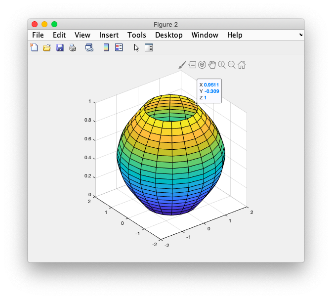

### # Scatter

```matlab
N = 250;
z = linspace(0,4*pi,N)';
x = 2*cos(z) + rand(N,1);
y = 2*sin(z) + rand(N,1);
%scale
s = 20 + 20 * rand(N,1);
%color
c = rand(N,3);
%gain(blue,red)
g = [linspace(0.2,1,N); 0.5*ones(1,N);
linspace(1,0,N)];

figure('Position',...
    [200 200 800 300], 'color','w');
subplot(1,2,1),scatter3(x,y,z);

subplot(1,2,2);
scatter3(x,y,z,s,c.*g,'fill');
view(-30,10);

```

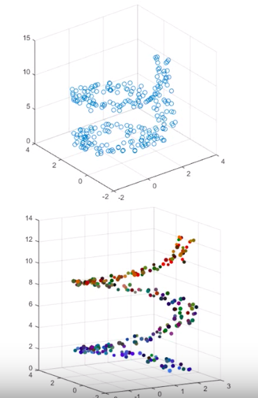


### # View command

- the direction of view /**azimuth and elevation**

```matlab
[X,Y] = meshgrid(-3:0.35:3,-3:0.35:3);
Z = 1.8.^(-1.5*sqrt(X.^2+Y.^2)).*sin(X) .*cos(Y/2);

figure(1)
mesh(X,Y,Z);

%view(3);
%view(2);
%view(90,0);
view(0,0);
```

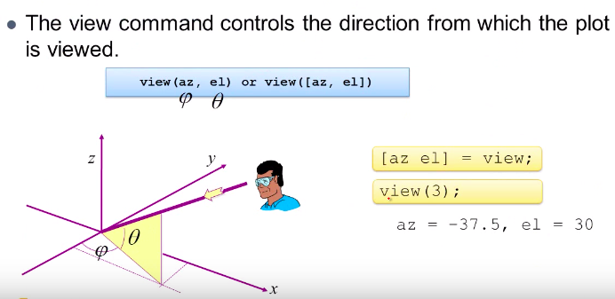

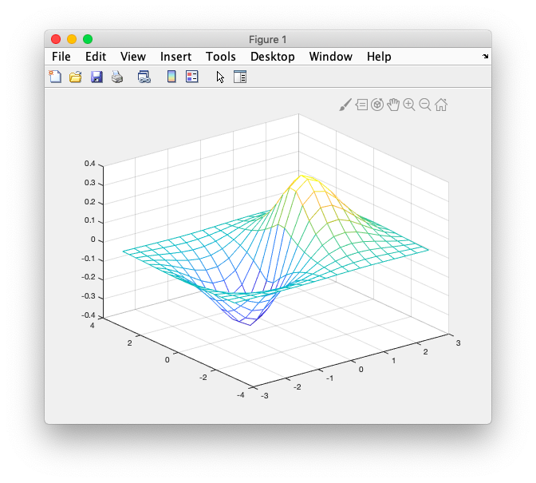

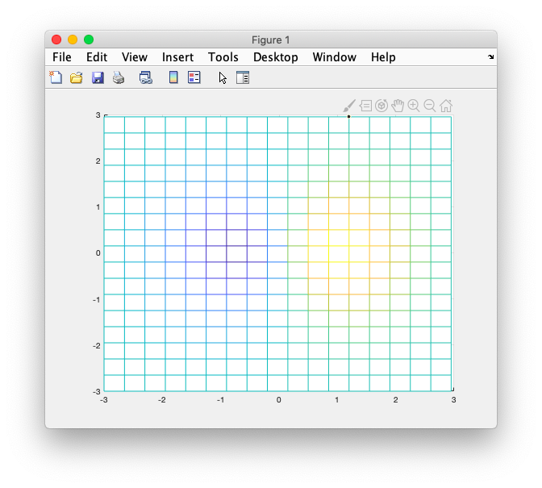

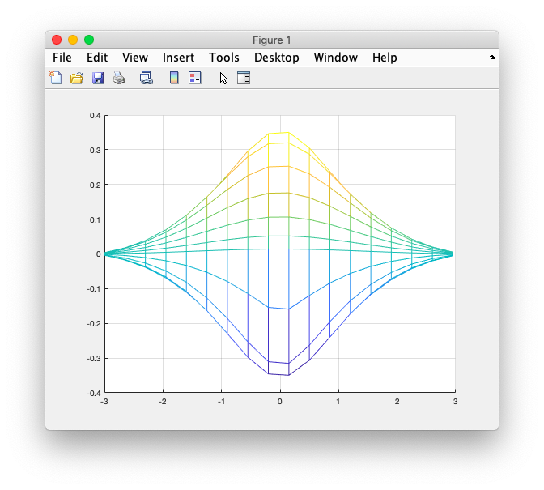

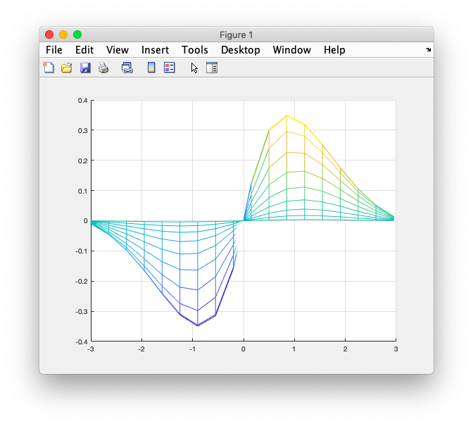


### # Color

```matlab
[X,Y] = meshgrid(-8:.5:8);
R = sqrt(X.^2 + Y.^2) + eps;
Z = sin(R)./R;

figure(1)
%1
%mesh(X,Y,Z,'EdgeColor','b');

%2
%surf(X,Y,Z); 
%colormap('hsv');

%3
%surf(X,Y,Z); alpha(0.4);

%4
surf(X,Y,Z,'FaceColor',...
    'red','EdgeColor','none');
camlight left; lighting phong;
```


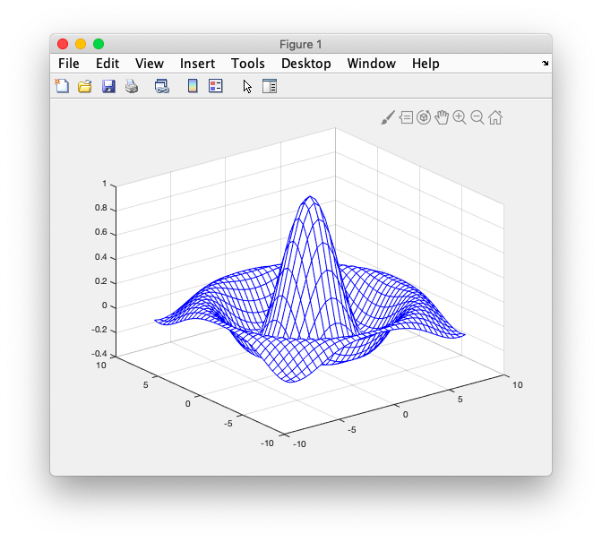

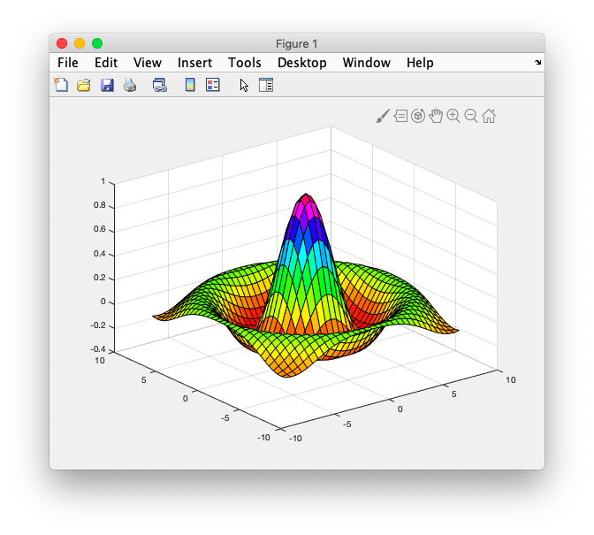

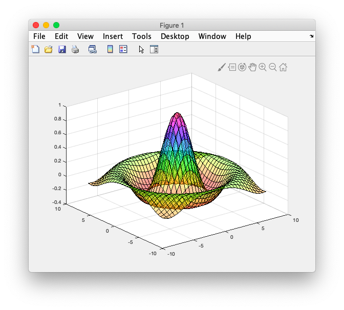

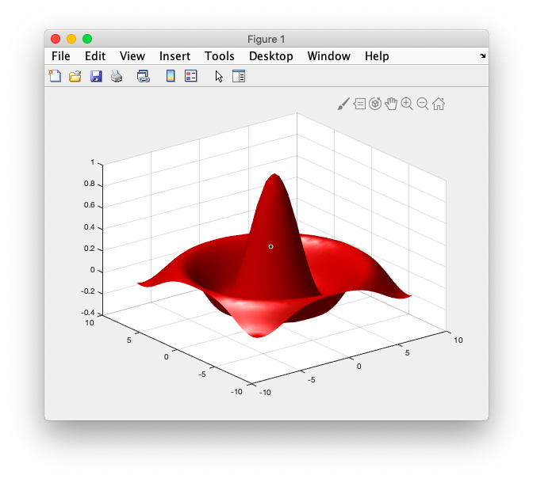

