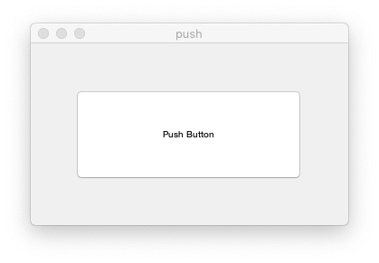
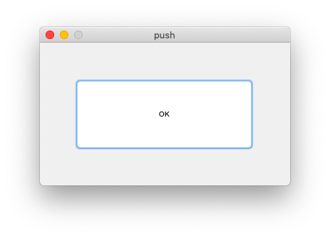
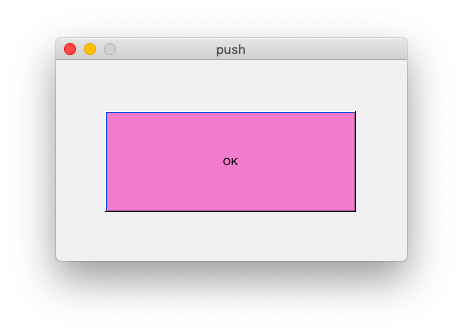
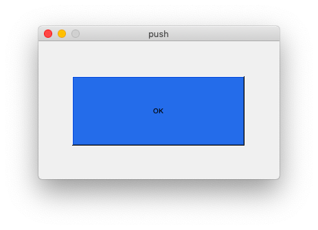

# 22.push button, call back


### # when push button clicked

```matlab

% --- Executes on button press in pushbutton1.
function pushbutton1_Callback(hObject, eventdata, handles)
        % hObject    handle to pushbutton1 (see GCBO)
        % eventdata  reserved - to be defined in a future version of MATLAB
        % handles    structure with handles and user data (see GUIDATA)

%disp(get(hObject, 'String'));
%set(hObject,'String','OK');
disp('clicked');
c = rand(1,3);
set(hObject,'BackgroundColor',c);
```








