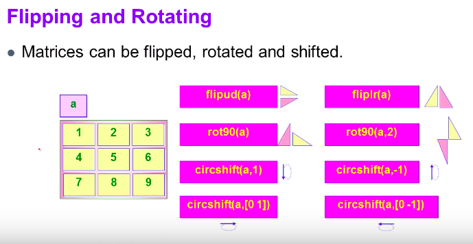

# 6. Flip, rotate, Upper, Lower and Diagonal


### # Flip, rotate




### # Upper, Lower and Diagonal

```matlab
>> a = [ 1 2 3 ; 4 5 6; 7 8 9]

a =

     1     2     3
     4     5     6
     7     8     9

>> d =diag(a)

d =

     1
     5
     9

>> c = diag(d)

c =

     1     0     0
     0     5     0
     0     0     9

>> U = triu(a)

U =

     1     2     3
     0     5     6
     0     0     9

>> N = tril(a)

N =

     1     0     0
     4     5     0
     7     8     9
```


