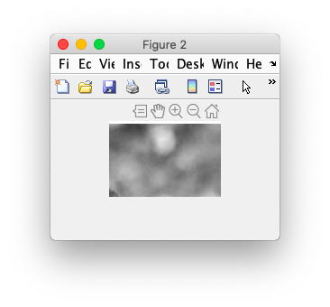
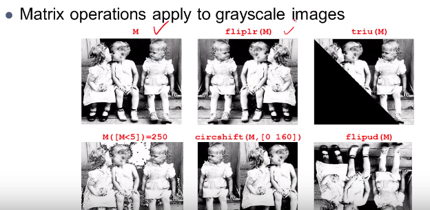

# 7. image 


### # Upper, Lower and Diagonal

```matlab
>> M = imread('sample.png');
>> figure(1), imshow(M);
>> figure(2), imshow(M(5:88,211:334))
>> S = M; 
>> S(1:5,:) =0; S(end-5:end,:) =0;
>> S(:,1:5) =0; S(:,end-5:end) =0;

>> figure(3),imshow(S)
```


### # result images





