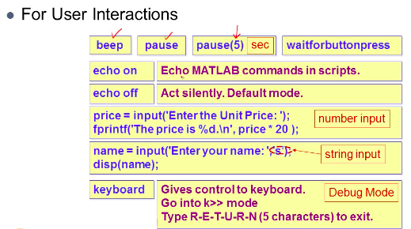
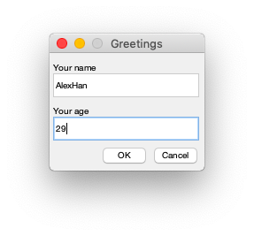
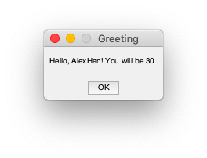
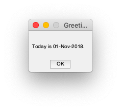
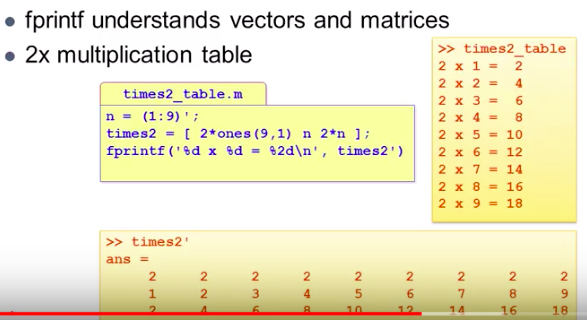
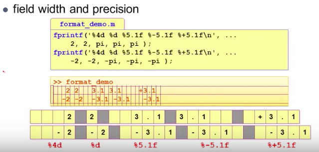

# 8. Script(.m file, dialog, disp, fprintf)


### # .m file

- New script -> clac_price.m

```matlab
nItem = input('Enter the num of items :');
nprice = input('Enter the unit price :');

IPrice = nItem * nprice

fprintf('the total price is %d.\n', IPrice);
```


### # get input, pause

```matlab
name = input('your name :','s');
age = input('your age: ');
fprintf(['Hello, %s! '...
    'you will be %d years old next year\n'],...
    name,age+1);

fprintf('Press key to continue..');
pause
today1 = date;
fprintf('\nToday is %s.\n', today1);
```




### # dialog input

```matlab
prompt = {'Your name', 'Your age'};
dig_title = 'Greetings';
num_lines = 1;
default = {'Alex','28'};
answer = inputdlg(prompt,dig_title,num_lines,default);
name = answer{1};
age = str2num(answer{2});
msg = sprintf('Hello, %s! You will be %d\n', name, age+1);
h = msgbox(msg,'Greeting');
uiwait(h)

today1 = date;
msg = sprintf('\nToday is %s.\n', today1)
h = msgbox(msg,'Greeting')

```








### # disp

```matlab
n = [8 1 6]
disp(n)
disp('Magic num :')
disp(['The magic nums are : ' num2str(n)])

%n =
%     8     1     6
%     8     1     6
%
%Magic num :
%The magic nums are : 8  1  6
```


### # fprintf 

```matlab
n = 7;
b = (1:9)'; % 1~9
T7 = [b n*b]; 
% 1 7
% 2 14
% ...
% 9 63


% 1  2  3  4 ... 
% 7 14 21 28 ...

fprintf('7 x %d = %2d\n',T7')

```





